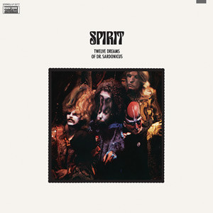

# Twelve Dreams Of Dr. Sardonicus

By Spirit

## Album Data

[Discogs URL](https://www.discogs.com/release/3613571-Spirit-(8)-Twelve-Dreams-Of-Dr.-Sardonicus)

- Catalog #: LP 5277, P 741407
- Label: Sundazed Music, Epic
- Formats: Vinyl
- Format: LP, Album, RE
- Rating: 
- Released: 2009
- Year: 1970
- Release ID: 3613571
- Media condition: Mint (M)
- Sleeve condition: Mint (M)
- Speed: 33 rpm
- Weight: 180 gram

## Album Tracks

| **Position** | **Title** | **Duration** |
|--------------|-----------|--------------|
| A1 | **Prelude - Nothin' To Hide** | 3:41 |
| A2 | **Nature's Way** | 2:30 |
| A3 | **Animal Zoo** | 3:20 |
| A4 | **Love Has Found A Way** | 2:42 |
| A5 | **Why Can't I Be Free** | 1:03 |
| A6 | **Mr. Skin** | 3:50 |
| B1 | **Space Child** | 3:26 |
| B2 | **When I Touch You** | 5:35 |
| B3 | **Street Worm** | 3:40 |
| B4 | **Life Has Just Begun** | 3:22 |
| B5 | **Morning Will Come** | 2:58 |
| B6 | **Soldier** | 2:43 |

## Artist Roles

| **Name** | **Role** |
|----------|----------|
| **Bruce McCauley** | Art Direction |
| **John Locke** | Art Direction |
| **Carl Rowatti** | Lacquer Cut By |
| **Bruce McCauley** | Photography By [Back Photograph], Graphics |
| **Ira Cohen** | Photography By [Color Photographs] |
| **David Briggs** | Producer |
| **Jay Ferguson** | Written-By |
| **John Locke** | Written-By |
| **Randy California** | Written-By |

## See also

- [Clear](Clear.md)
- [Spirit](Spirit.md)
- [Beets: Clear](../../Beets/Spirit/Clear.md)
- [Beets: Feedback](../../Beets/Spirit/Feedback.md)
- [Beets: Spirit](../../Beets/Spirit/Spirit.md)
- [Beets: The Best Of Spirit](../../Beets/Spirit/The_Best_Of_Spirit.md)
- [Beets: The Family That Plays Together](../../Beets/Spirit/The_Family_That_Plays_Together.md)
- [Beets: Twelve Dreams of Dr. Sardonicus](../../Beets/Spirit/Twelve_Dreams_of_Dr_Sardonicus.md)
- [Roon: Clear](../../Roon/Spirit/Clear.md)
- [Roon: Feedback](../../Roon/Spirit/Feedback.md)
- [Roon: Spirit](../../Roon/Spirit/Spirit.md)
- [Roon: The Best Of Spirit](../../Roon/Spirit/The_Best_Of_Spirit.md)
- [Roon: The Family That Plays Together](../../Roon/Spirit/The_Family_That_Plays_Together.md)
- [Roon: Twelve Dreams Of Dr. Sardonicus](../../Roon/Spirit/Twelve_Dreams_Of_Dr_Sardonicus.md)
