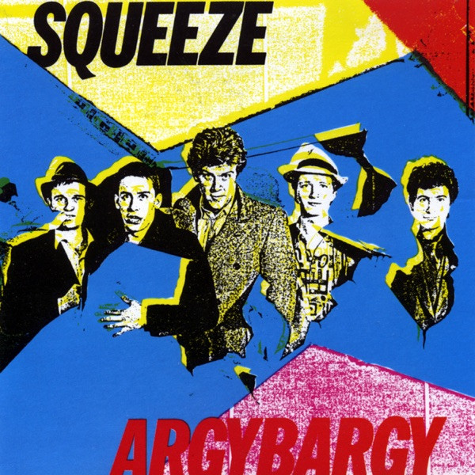

# Argybargy

By Squeeze

## Album Data

[Discogs URL](https://www.discogs.com/release/488582-Squeeze-(2)-Argybargy)

- Catalog #: SP-4802
- Label: A&M Records
- Format: LP, Album, San
- Rating: 
- Released: 1980
- Release ID: 488582
- Media condition: Very Good (VG)
- Sleeve condition: Good Plus (G+)
- Speed: 33 rpm
- Weight: 

## Album Tracks

| **Position** | **Title** | **Duration** |
|--------------|-----------|--------------|
| A1 | **Pulling Mussels (From The Shell)** | 4:00 |
| A2 | **Another Nail In My Heart** | 2:58 |
| A3 | **Separate Beds** | 3:21 |
| A4 | **Misadventure** | 2:56 |
| A5 | **I Think I'm Go Go** | 4:19 |
| B1 | **If I Didn't Love You** | 4:13 |
| B2 | **Farfisa Beat** | 2:58 |
| B3 | **Here Comes That Feeling** | 2:12 |
| B4 | **Vicky Verky** | 3:12 |
| B5 | **Wrong Side Of The Moon** | 2:25 |
| B6 | **There At The Top** | 3:46 |

## See also

- [Sweets From A Stranger](Sweets_From_A_Stranger.md)
- [Beets: Argybargy](../../Beets/Squeeze/Argybargy.md)
- [Beets: Sweets From a Stranger](../../Beets/Squeeze/Sweets_From_a_Stranger.md)
- [Roon: Cool For Cats](../../Roon/Squeeze/Cool_For_Cats.md)
- [Roon: Play](../../Roon/Squeeze/Play.md)
- [Roon: Some Fantastic Place](../../Roon/Squeeze/Some_Fantastic_Place.md)
- [Roon: The Knowledge](../../Roon/Squeeze/The_Knowledge.md)
