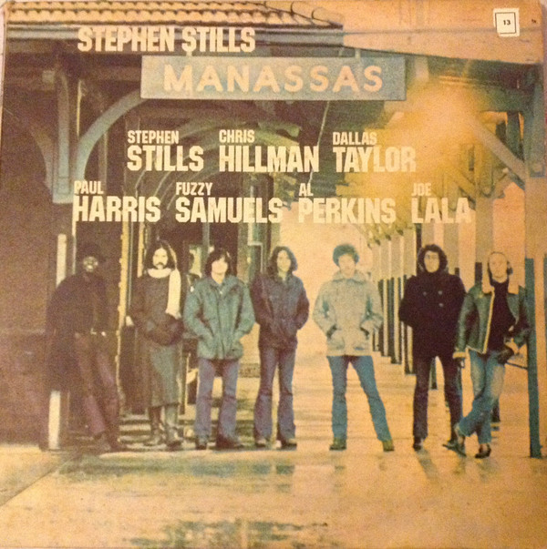

# Manassas

By "Stephen Stills, Manassas"

## Album Data

[Discogs URL](https://www.discogs.com/release/2752255-"Stephen-Stills,-Manassas"-Manassas)

- Catalog #: RA1 903
- Label: Atlantic
- Format: 2xLP, Album, RE, 180
- Rating: 
- Released: 2010
- Release ID: 2752255
- Media condition: Mint (M)
- Sleeve condition: Mint (M)
- Speed: 33 rpm
- Weight: 180 gram

## Album Tracks

| **Position** | **Title** | **Duration** |
|--------------|-----------|--------------|
|  | **The Raven** |  |
| A1 | **Song Of Love** | 3:28 |
| A2a | **Rock & Roll Crazies** |  |
| A2b | **Cuban Bluegrass** | 3:34 |
| A3 | **Jet Set (Sigh)** | 4:25 |
| A4 | **Anyway** | 3:21 |
| A5 | **Both Of Us (Bound To Lose)** | 3:00 |
|  | **The Wilderness** |  |
| B1 | **Fallen Eagle** | 2:05 |
| B2 | **Jesus Gave Love Away For Free** | 3:00 |
| B3 | **Colorado** | 2:53 |
| B4 | **So Begins The Task** | 4:00 |
| B5 | **Hide It So Deep** | 2:46 |
| B6 | **Don't Look At My Shadow** | 2:31 |
|  | **Consider** |  |
| C1 | **It Doesn't Matter** | 2:30 |
| C2 | **Johnny's Garden** | 2:46 |
| C3 | **Bound To Fall** | 1:54 |
| C4 | **How Far** | 2:52 |
| C5 | **Move Around** | 4:17 |
| C6 | **The Love Gangster** | 2:52 |
|  | **Rock & Roll Is Here To Stay** |  |
| D1 | **What To Do** | 4:44 |
| D2 | **Right Now** | 3:00 |
| D3 | **The Treasure (Take One)** | 8:09 |
| D4 | **Blues Man** | 4:05 |

## See also

- 
