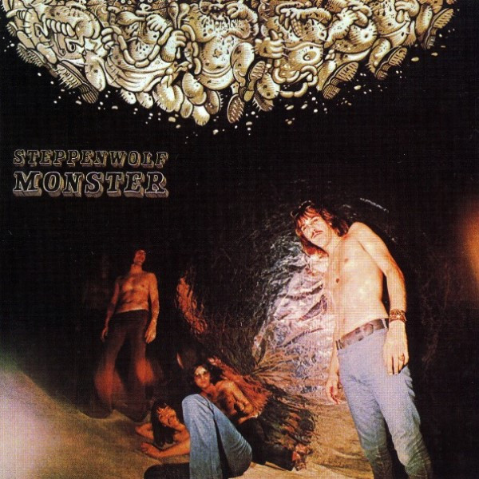

# Monster

By Steppenwolf

## Album Data

[Discogs URL](https://www.discogs.com/release/6023523-Steppenwolf-Monster)

- Catalog #: 45-D-4221
- Label: ABC/Dunhill Records
- Format: 7", Single
- Rating: 
- Released: 1970
- Release ID: 6023523
- Media condition: Very Good Plus (VG+)
- Sleeve condition: 
- Speed: 45 rpm
- Weight: 

## Album Tracks

| **Position** | **Title** | **Duration** |
|--------------|-----------|--------------|
| A | **Monster** | 3:55 |
| B | **Berry Rides Again** | 2:45 |

## Artist Roles

| **Name** | **Role** |
|----------|----------|
| **Gabriel Mekler** | Producer |
| **John Kay** | Written-By |

## See also

- [Steppenwolf](Steppenwolf.md)
- [Beets: Monster](../../Beets/Steppenwolf/Monster.md)
- [Beets: Steppenwolf](../../Beets/Steppenwolf/Steppenwolf.md)
- [Beets: The Second](../../Beets/Steppenwolf/The_Second.md)
- [CD: Monster](../../CD/Steppenwolf/Monster.md)
- [CD: ](../../CD/Steppenwolf/Steppenwolf_index.md)
- [CD: Steppenwolf](../../CD/Steppenwolf/Steppenwolf.md)
- [CD: The Second](../../CD/Steppenwolf/The_Second.md)
- [Roon: Monster](../../Roon/Steppenwolf/Monster.md)
- [Roon: Steppenwolf](../../Roon/Steppenwolf/Steppenwolf.md)
- [Roon: The Second](../../Roon/Steppenwolf/The_Second.md)
