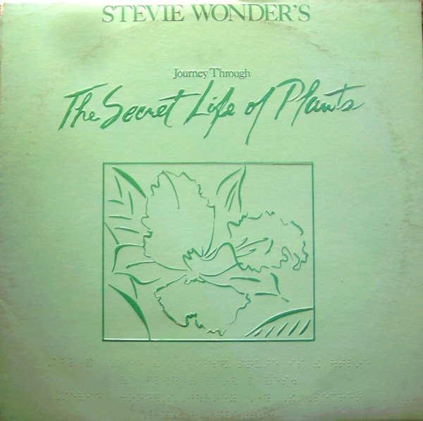

# Stevie Wonder's Journey Through The Secret Life Of Plants

By Stevie Wonder

## Album Data

[Discogs URL](https://www.discogs.com/release/3458476-Stevie-Wonder-Stevie-Wonder's-Journey-Through-The-Secret-Life-Of-Plants)

- Catalog #: T13-371C2
- Label: Tamla
- Format: 2xLP, Album, Tri
- Rating: 
- Released: 1979
- Release ID: 3458476
- Media condition: Very Good (VG)
- Sleeve condition: Very Good (VG)
- Speed: 33 rpm
- Weight: 

## Album Tracks

| **Position** | **Title** | **Duration** |
|--------------|-----------|--------------|
| A1 | **Earth's Creation** | 4:06 |
| A2 | **The First Garden** | 2:33 |
| A3 | **Voyage To India** | 6:23 |
| A4 | **Same Old Story** | 3:45 |
| A5 | **Venus' Flytrap And The Bug** | 2:24 |
| A6 | **Ai No, Sono** | 2:05 |
| B1 | **Seasons** | 2:53 |
| B2 | **Power Flower** | 5:31 |
| B3 | **Send One Your Love (Music)** | 3:05 |
| B4 | **Race Babbling** | 8:51 |
| C1 | **Send One Your Love** | 4:02 |
| C2 | **Outside My Window** | 5:29 |
| C3 | **Black Orchid** | 3:48 |
| C4 | **Ecclesiastes** | 3:44 |
| C5 | **Kesse Ye Lolo De Ye** | 3:00 |
| C6 | **Come Back As A Flower** | 3:23 |
| D1 | **A Seed's A Star And Tree Medley** | 5:41 |
| D2 | **The Secret Life Of Plants** | 4:28 |
| D3 | **Tree** | 5:55 |
| D4 | **Finale** | 6:47 |

## See also

- [Songs In The Key Of Life](Songs_In_The_Key_Of_Life.md)
- [Beets: Definitive Collection](../../Beets/Stevie_Wonder/Definitive_Collection.md)
- [Beets: Innervisions](../../Beets/Stevie_Wonder/Innervisions.md)
- [Roon: Innervisions](../../Roon/Stevie_Wonder/Innervisions.md)
- [Roon: Journey Through The Secret Life Of Plants](../../Roon/Stevie_Wonder/Journey_Through_The_Secret_Life_Of_Plants.md)
