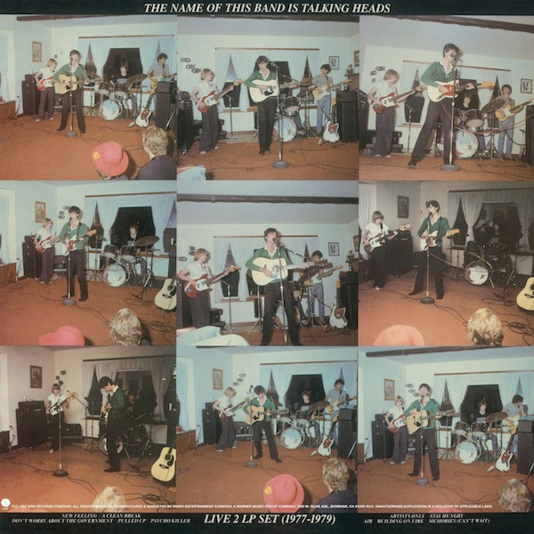

# The Name Of This Band Is Talking Heads

By Talking Heads

## Album Data

[Discogs URL](https://www.discogs.com/release/5140961-Talking-Heads-The-Name-Of-This-Band-Is-Talking-Heads)

- Catalog #: R1 3590
- Label: Sire
- Format: 2xLP, Album, RE, 180
- Rating: 
- Released: 2013
- Release ID: 5140961
- Media condition: Mint (M)
- Sleeve condition: Very Good Plus (VG+)
- Speed: 33 rpm
- Weight: 180 gram

## Album Tracks

| **Position** | **Title** | **Duration** |
|--------------|-----------|--------------|
|  | **The Name Of This Band Is Talking Heads 1977-1979** |  |
| A1 | **New Feeling** | 3:10 |
| A2 | **A Clean Break** | 4:57 |
| A3 | **Don't Worry About The Government** | 3:08 |
| A4 | **Pulled Up** | 4:08 |
| A5 | **Psycho Killer** | 5:34 |
| B1 | **Artists Only** | 3:48 |
| B2 | **Stay Hungry** | 4:00 |
| B3 | **Air** | 4:09 |
| B4 | **Buildings On Fire** | 3:36 |
| B5 | **Memories (Can't Wait)** | 3:58 |
|  | **The Name Of This Band Is Talking Heads 1980-1981** |  |
| C1 | **I Zimbra** | 3:33 |
| C2 | **Drugs** | 4:47 |
| C3 | **Houses In Motion** | 7:00 |
| C4 | **Life During Wartime** | 5:03 |
| D1 | **The Great Curve** | 6:58 |
| D2 | **Crosseyed And Painless** | 7:05 |
| D3 | **Take Me To The River** | 6:43 |

## See also

- [Fear Of Music](Fear_Of_Music.md)
- [More Songs About Buildings And Food](More_Songs_About_Buildings_And_Food.md)
- [Speaking In Tongues](Speaking_In_Tongues.md)
- [Beets: Chronology](../../Beets/Talking_Heads/Chronology.md)
- [Beets: Fear of Music](../../Beets/Talking_Heads/Fear_of_Music.md)
- [Beets: Little Creatures](../../Beets/Talking_Heads/Little_Creatures.md)
- [Beets: More Songs About Buildings and Food](../../Beets/Talking_Heads/More_Songs_About_Buildings_and_Food.md)
- [Beets: Naked](../../Beets/Talking_Heads/Naked.md)
- [Beets: Remain in Light](../../Beets/Talking_Heads/Remain_in_Light.md)
- [Beets: Speaking in Tongues](../../Beets/Talking_Heads/Speaking_in_Tongues.md)
- [Beets: Talking Heads](../../Beets/Talking_Heads/Talking_Heads.md)
- [Beets: The Name of This Band Is Talking Heads](../../Beets/Talking_Heads/The_Name_of_This_Band_Is_Talking_Heads.md)
- [Roon: Fear of Music (Deluxe Version)](../../Roon/Talking_Heads/Fear_of_Music_Deluxe_Version.md)
- [Roon: Little Creatures (Deluxe Version)](../../Roon/Talking_Heads/Little_Creatures_Deluxe_Version.md)
- [Roon: More Songs About Buildings and Food](../../Roon/Talking_Heads/More_Songs_About_Buildings_and_Food.md)
- [Roon: Naked](../../Roon/Talking_Heads/Naked.md)
- [Roon: Remain In Light](../../Roon/Talking_Heads/Remain_In_Light.md)
- [Roon: Speaking in Tongues](../../Roon/Talking_Heads/Speaking_in_Tongues.md)
- [Roon: Stop Making Sense (Special New Edition) (Live)](../../Roon/Talking_Heads/Stop_Making_Sense_Special_New_Edition_Live.md)
- [Roon: Talking Heads](../../Roon/Talking_Heads/Talking_Heads-_77.md)
- [Roon: The Name of This Band Is Talking Heads (Expanded 2004 Remaster)](../../Roon/Talking_Heads/The_Name_of_This_Band_Is_Talking_Heads_Expanded_2004_Remaster.md)
