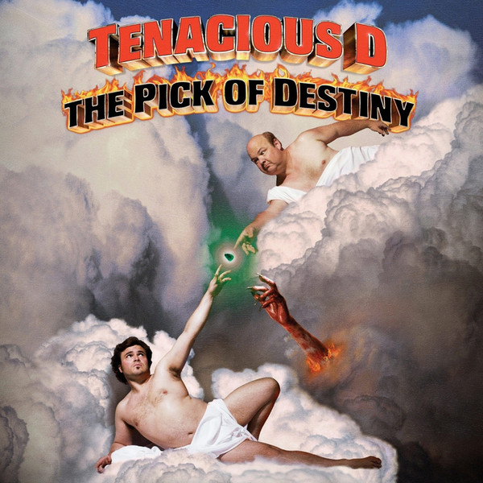

# The Pick Of Destiny

By Tenacious D

## Album Data

[Discogs URL](https://www.discogs.com/release/6340675-Tenacious-D-The-Pick-Of-Destiny)

- Catalog #: 88875007161
- Label: Epic, Legacy
- Format: LP, Album, RE, 180
- Rating: 
- Released: 2014
- Year: 2006
- Release ID: 6340675
- Media condition: Near Mint (NM or M-)
- Sleeve condition: Near Mint (NM or M-)
- Speed: 33 rpm
- Weight: 180 gram

## Album Tracks

| **Position** | **Title** | **Duration** |
|--------------|-----------|--------------|
| A1 | **Kickapoo** |  |
| A2 | **Classico** |  |
| A3 | **Baby** |  |
| A4 | **Destiny** |  |
| A5 | **History** |  |
| A6 | **The Government Totally Sucks** |  |
| A7 | **Master Exploder** |  |
| A8 | **The Divide** |  |
| A9 | **Papagenu (He's My Sassafrass)** |  |
| B1 | **Dude (I Totally Miss You)** |  |
| B2 | **Break In-City (Storm The Gate!)** |  |
| B3 | **Car Chase City** |  |
| B4 | **Beelzeboss (The Final Showdown)** |  |
| B5 | **POD** |  |
| B6 | **The Metal** |  |

## Artist Roles

| **Name** | **Role** |
|----------|----------|
| **Matt Marshall (3)** | A&R |
| **Andrew Gross** | Arranged By [Orchestral Arrangements] |
| **John Spiker** | Bass |
| **Dave Grohl** | Drums |
| **John Konesky** | Electric Guitar |
| **Brad Breeck** | Engineer [Assistant] |
| **Ed Cherney** | Engineer [Assistant] |
| **John Spiker** | Engineer [Assistant] |
| **Nick Raskulinecz** | Engineer [Assistant] |
| **Casey Stone** | Engineer [Bari Sax And Piano] |
| **Casey Stone** | Engineer [Orchestral Arrangements] |
| **Bob Bowen** | Executive-Producer [Music Executive For New Line] |
| **Silva Artist Management** | Management |
| **Tom Baker (3)** | Mastered By |
| **Ken Andrews** | Mixed By |
| **John King** | Producer |
| **Jack Black (2)** | Vocals, Acoustic Guitar |
| **Kyle Gass** | Vocals, Acoustic Guitar |
| **Jack Black (2)** | Written-By |
| **John King** | Written-By |
| **John Konesky** | Written-By |
| **John Spiker** | Written-By |
| **Kyle Gass** | Written-By |
| **Liam Lynch** | Written-By |

## See also

- [Tenacious D](Tenacious_D.md)
- [Beets: D Fun Pak](../../Beets/Tenacious_D/D_Fun_Pak.md)
- [Beets: Rize of the Fenix](../../Beets/Tenacious_D/Rize_of_the_Fenix.md)
- [Beets: Tenacious D](../../Beets/Tenacious_D/Tenacious_D.md)
- [Beets: The Pick Of Destiny [Explicit]](../../Beets/Tenacious_D/The_Pick_Of_Destiny_[Explicit].md)
- [CD: ](../../CD/Tenacious_D/Tenacious_D_index.md)
- [CD: Tenacious D](../../CD/Tenacious_D/Tenacious_D.md)
- [CD: The Pick Of Destiny](../../CD/Tenacious_D/The_Pick_Of_Destiny.md)
- [Roon: Post-Apocalypto](../../Roon/Tenacious_D/Post-Apocalypto.md)
- [Roon: Rize Of The Fenix](../../Roon/Tenacious_D/Rize_Of_The_Fenix.md)
- [Roon: Tenacious D](../../Roon/Tenacious_D/Tenacious_D.md)
- [Roon: The Pick Of Destiny](../../Roon/Tenacious_D/The_Pick_Of_Destiny.md)
