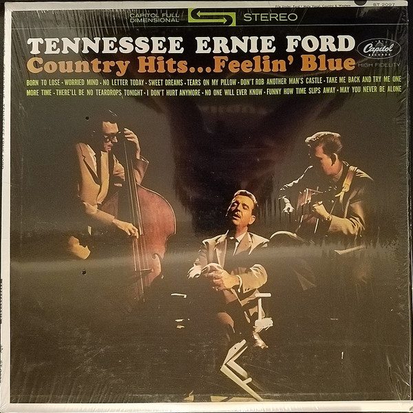

# Country Hits...Feelin' Blue

By Tennessee Ernie Ford

## Album Data

[Discogs URL](https://www.discogs.com/release/5663679-Tennessee-Ernie-Ford-Country-Hits...Feelin'-Blue)

- Catalog #: ST 2097
- Label: Capitol Records
- Format: LP
- Rating: 
- Released: 1964
- Release ID: 5663679
- Media condition: Very Good Plus (VG+)
- Sleeve condition: Very Good Plus (VG+)
- Speed: 33 rpm
- Weight: 

## Album Tracks

| **Position** | **Title** | **Duration** |
|--------------|-----------|--------------|
| A1 | **Try Me One More Time** | 2:38 |
| A2 | **No Letter Today** | 2:30 |
| A3 | **Born To Lose** | 3:11 |
| A4 | **Don't Rob Another Man's Castle** | 2:52 |
| A5 | **There'll Be No Teardrops Tonight** | 2:45 |
| A6 | **I Don't Hurt Anymore** | 2:46 |
| B1 | **Worried Mind** | 2:29 |
| B2 | **No One Will Ever Know** | 2:57 |
| B3 | **Funny How Time Slips Away** | 3:08 |
| B4 | **Sweet Dreams** | 2:51 |
| B5 | **Tears On My Pillow** | 2:45 |
| B6 | **May You Never Walk Alone** | 2:40 |

## See also

- [This Lusty Land!](This_Lusty_Land!.md)
- [Roon: Ernie Sings And Glen Picks](../../Roon/Tennessee_Ernie_Ford/Ernie_Sings_And_Glen_Picks.md)
- [Roon: Sixteen Tons](../../Roon/Tennessee_Ernie_Ford/Sixteen_Tons.md)
