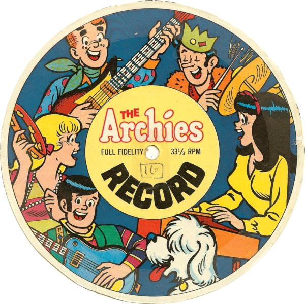

# Everything's Archie

By The Archies

## Album Data

[Discogs URL](https://www.discogs.com/release/8641758-The-Archies-Everything's-Archie)

- Catalog #: LM-2312
- Label: Liming Record
- Formats: Vinyl
- Format: LP, Album, Unofficial, Unofficial Release
- Rating: 
- Released: 1969
- Year: 1969
- Release ID: 8641758
- Media condition: Very Good Plus (VG+)
- Sleeve condition: Very Good (VG)
- Speed: 33 rpm
- Weight: 

## Notes

This copy's cover has "LM-416" while the label says "LW-416-A" and "LW-416-B"

## Album Tracks

| **Position** | **Title** | **Duration** |
|--------------|-----------|--------------|
| A1 | **Feelin' So Good** |  |
| A2 | **Melody Hill** |  |
| A3 | **Rock & Roll Music** |  |
| A4 | **Kissin** |  |
| A5 | **Don't Touch My Guitar** |  |
| A6 | **Circle Of Blue** |  |
| B1 | **Sugar Sugar** |  |
| B2 | **You Little Angel** |  |
| B3 | **Bicycles, Roller Skats And You** |  |
| B4 | **Hot Dog** |  |
| B5 | **Inside Out - Upside Down** |  |
| B6 | **Love Light** |  |

## See also

- 
- [Beets: Everything's Archie](../../Beets/The_Archies/Everythings_Archie.md)
- [Beets: The Very Best of the Archies [Cleopatra]](../../Beets/The_Archies/The_Very_Best_of_the_Archies_[Cleopatra].md)
