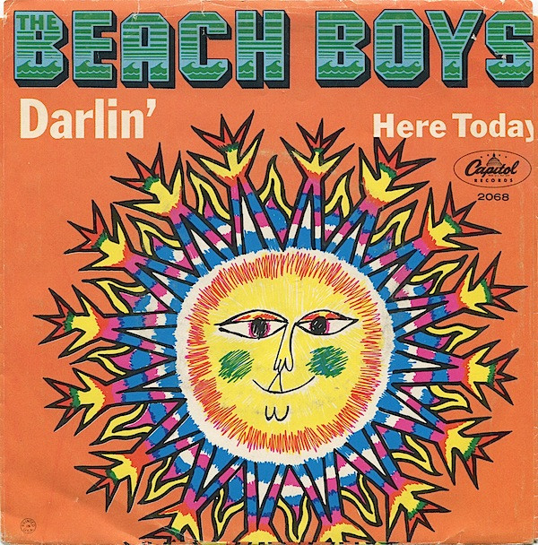

# Darlin' / Here Today

By The Beach Boys

## Album Data

[Discogs URL](https://www.discogs.com/release/1594391-The-Beach-Boys-Darlin'-/-Here-Today)

- Catalog #: 2068
- Label: Capitol Records
- Format: 7", Scr
- Rating: 
- Released: 1967
- Release ID: 1594391
- Media condition: Very Good Plus (VG+)
- Sleeve condition: 
- Speed: 45 rpm
- Weight: 

## Album Tracks

| **Position** | **Title** | **Duration** |
|--------------|-----------|--------------|
| A | **Darlin'** | 2:11 |
| B | **Here Today** | 2:38 |

## See also

- ["Dance, Dance, Dance"](Dance__Dance__Dance.md)
- [Good Vibrations](Good_Vibrations.md)
- [Holland](Holland.md)
- [Love You](Love_You.md)
- [Pet Sounds](Pet_Sounds.md)
- [Summer Days (And Summer Nights!!)](Summer_Days_And_Summer_Nights!!.md)
- [Beets: 1964](../../Beets/The_Beach_Boys/1964.md)
- [Beets: Holland](../../Beets/The_Beach_Boys/Holland.md)
- [Beets: Pet Sounds](../../Beets/The_Beach_Boys/Pet_Sounds.md)
- [Beets: Smile (TSV6-1967)](../../Beets/The_Beach_Boys/Smile_TSV6-1967.md)
- [Beets: Sounds Of Summer](../../Beets/The_Beach_Boys/Sounds_Of_Summer.md)
- [Beets: Summer Days (and Summer Nights!!)](../../Beets/The_Beach_Boys/Summer_Days_and_Summer_Nights!!.md)
- [Beets: Summer Days (and Summer Nights) (Mono & Stereo Remaster)](../../Beets/The_Beach_Boys/Summer_Days_and_Summer_Nights_Mono_and_Stereo_Remaster.md)
- [Beets: The Beach Boys Love You](../../Beets/The_Beach_Boys/The_Beach_Boys_Love_You.md)
- [Beets: The Very Best Of The Beach Boys](../../Beets/The_Beach_Boys/The_Very_Best_Of_The_Beach_Boys.md)
- [CD: Pet Sounds](../../CD/The_Beach_Boys/Pet_Sounds.md)
- [CD: ](../../CD/The_Beach_Boys/The_Beach_Boys.md)
- [Roon: All Summer Long (Mono)](../../Roon/The_Beach_Boys/All_Summer_Long_Mono.md)
- [Roon: Endless Summer](../../Roon/The_Beach_Boys/Endless_Summer.md)
- [Roon: Pet Sounds (Mono & Stereo)](../../Roon/The_Beach_Boys/Pet_Sounds_Mono_and_Stereo.md)
- [Roon: Smiley Smile (Mono)](../../Roon/The_Beach_Boys/Smiley_Smile_Mono.md)
- [Roon: Sounds of Summer](../../Roon/The_Beach_Boys/Sounds_of_Summer-_The_Very_Best_of_the_Beach_Boys.md)
- [Roon: Summer Days (And Summer Nights) (Mono & Stereo)](../../Roon/The_Beach_Boys/Summer_Days_And_Summer_Nights_Mono_and_Stereo.md)
- [Roon: Surf's Up](../../Roon/The_Beach_Boys/Surfs_Up.md)
- [Roon: The Beach Boys Today! (Mono & Stereo)](../../Roon/The_Beach_Boys/The_Beach_Boys_Today!_Mono_and_Stereo.md)
- [Roon: The Beach Boys With The Royal Philharmonic Orchestra](../../Roon/The_Beach_Boys/The_Beach_Boys_With_The_Royal_Philharmonic_Orchestra.md)
- [Roon: The Very Best Of The Beach Boys](../../Roon/The_Beach_Boys/The_Very_Best_Of_The_Beach_Boys-_Sounds_Of_Summer_Expanded_Edition_Super_Deluxe.md)
- [Roon: The Very Best Of The Beach Boys](../../Roon/The_Beach_Boys/The_Very_Best_Of_The_Beach_Boys-_Sounds_Of_Summer.md)
