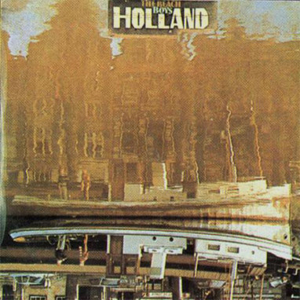

# Holland

By The Beach Boys

## Album Data

[Discogs URL](https://www.discogs.com/release/1568483-The-Beach-Boys-Holland)

- Catalog #: MS 2118
- Label: Reprise Records, Brother Records (3)
- Format: LP, Album + 7", EP
- Rating: 
- Released: 1973
- Release ID: 1568483
- Media condition: Very Good Plus (VG+)
- Sleeve condition: Very Good Plus (VG+)
- Speed: 33 rpm
- Weight: 

## See also

- ["Dance, Dance, Dance"](Dance__Dance__Dance.md)
- [Darlin' / Here Today](Darlin_-_Here_Today.md)
- [Good Vibrations](Good_Vibrations.md)
- [Love You](Love_You.md)
- [Pet Sounds](Pet_Sounds.md)
- [Summer Days (And Summer Nights!!)](Summer_Days_And_Summer_Nights!!.md)
