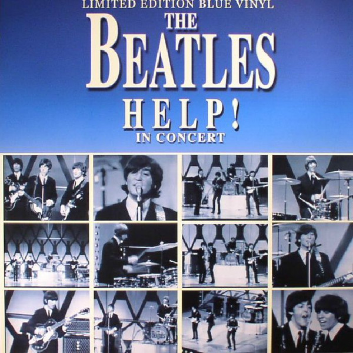

# Help! In Concert

By The Beatles

## Album Data

[Discogs URL](https://www.discogs.com/release/9956098-The-Beatles-Help!-In-Concert)

- Catalog #: CPLVNY193
- Label: Coda Publishing
- Format: LP, Mono, Ltd, Unofficial, Sky
- Rating: 
- Released: 2016
- Release ID: 9956098
- Media condition: Mint (M)
- Sleeve condition: Mint (M)
- Speed: 33 rpm
- Weight: 

## See also

- [Beatles '65](Beatles_65.md)
- [Help! (Original Motion Picture Soundtrack)](Help!_Original_Motion_Picture_Soundtrack.md)
- [Hey Jude](Hey_Jude.md)
- [Introducing... The Beatles](Introducing_The_Beatles.md)
- [Let It Be](Let_It_Be.md)
- [Live In Paris '65](Live_In_Paris_65.md)
- [Magical Mystery Tour](Magical_Mystery_Tour.md)
- [Something New](Something_New.md)
- [The Beatles](The_Beatles.md)
- [The Beatles' Second Album](The_Beatles_Second_Album.md)
