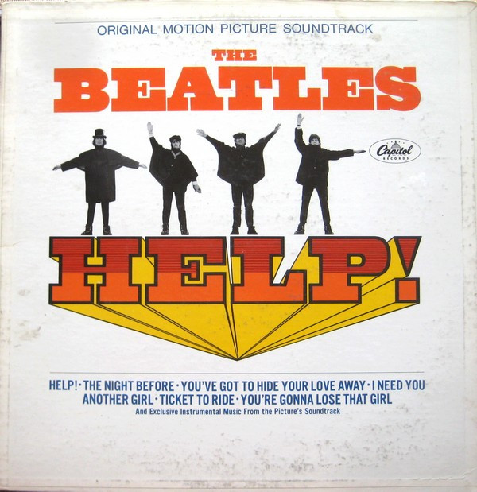

# Help! (Original Motion Picture Soundtrack)

By The Beatles

## Album Data

[Discogs URL](https://www.discogs.com/release/3673507-The-Beatles-Help!-(Original-Motion-Picture-Soundtrack))

- Catalog #: MAS-2386, MAS 2386
- Label: Capitol Records, Capitol Records
- Format: LP, Album, Mono, Los
- Rating: 
- Released: 1965
- Release ID: 3673507
- Media condition: Very Good (VG)
- Sleeve condition: Good (G)
- Speed: 33 rpm
- Weight: 

## See also

- [Beatles '65](Beatles_65.md)
- [Help! In Concert](Help!_In_Concert.md)
- [Hey Jude](Hey_Jude.md)
- [Introducing... The Beatles](Introducing_The_Beatles.md)
- [Let It Be](Let_It_Be.md)
- [Live In Paris '65](Live_In_Paris_65.md)
- [Magical Mystery Tour](Magical_Mystery_Tour.md)
- [Something New](Something_New.md)
- [The Beatles](The_Beatles.md)
- [The Beatles' Second Album](The_Beatles_Second_Album.md)
