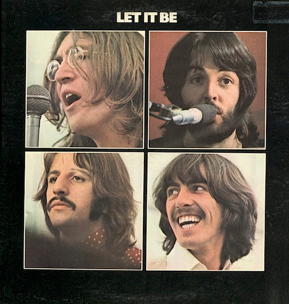

# Let It Be

By The Beatles

## Album Data

[Discogs URL](https://www.discogs.com/release/4541526-The-Beatles-Let-It-Be)

- Catalog #: AR 34001
- Label: Apple Records
- Format: LP, Album, Los
- Rating: 
- Released: 1970
- Release ID: 4541526
- Media condition: Very Good Plus (VG+)
- Sleeve condition: Good (G)
- Speed: 33 rpm
- Weight: 

## See also

- [Beatles '65](Beatles_65.md)
- [Help! In Concert](Help!_In_Concert.md)
- [Help! (Original Motion Picture Soundtrack)](Help!_Original_Motion_Picture_Soundtrack.md)
- [Hey Jude](Hey_Jude.md)
- [Introducing... The Beatles](Introducing_The_Beatles.md)
- [Live In Paris '65](Live_In_Paris_65.md)
- [Magical Mystery Tour](Magical_Mystery_Tour.md)
- [Something New](Something_New.md)
- [The Beatles](The_Beatles.md)
- [The Beatles' Second Album](The_Beatles_Second_Album.md)
