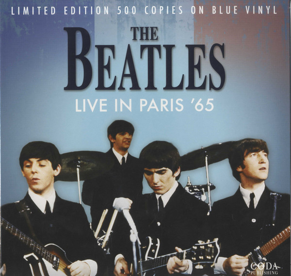

# Live In Paris '65

By The Beatles

## Album Data

[Discogs URL](https://www.discogs.com/release/8131788-The-Beatles-Live-In-Paris-'65)

- Catalog #: CPLVNY080
- Label: Coda Publishing
- Format: LP, Ltd, RM, Unofficial, Blu
- Rating: 
- Released: 2016
- Release ID: 8131788
- Media condition: Mint (M)
- Sleeve condition: Mint (M)
- Speed: 33 rpm
- Weight: 

## See also

- [Beatles '65](Beatles_65.md)
- [Help! In Concert](Help!_In_Concert.md)
- [Help! (Original Motion Picture Soundtrack)](Help!_Original_Motion_Picture_Soundtrack.md)
- [Hey Jude](Hey_Jude.md)
- [Introducing... The Beatles](Introducing_The_Beatles.md)
- [Let It Be](Let_It_Be.md)
- [Magical Mystery Tour](Magical_Mystery_Tour.md)
- [Something New](Something_New.md)
- [The Beatles](The_Beatles.md)
- [The Beatles' Second Album](The_Beatles_Second_Album.md)
