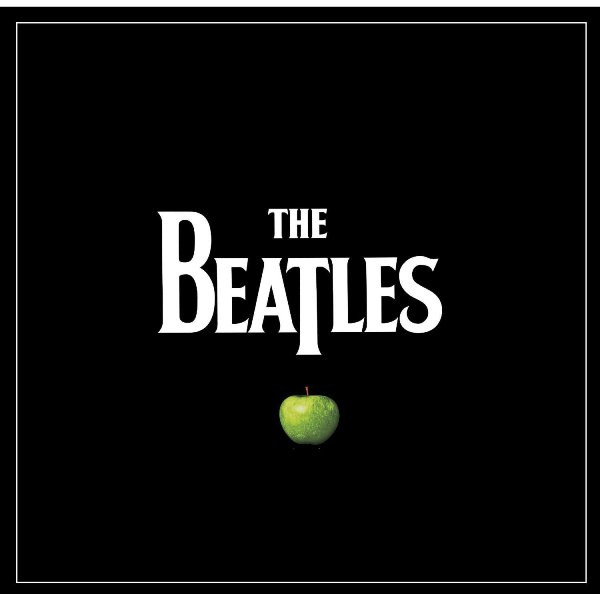

# The Beatles

By The Beatles

## Album Data

[Discogs URL](https://www.discogs.com/release/4030692-The-Beatles-The-Beatles)

- Catalog #: 5099963380910
- Label: Apple Records, Parlophone, Capitol Records
- Format: Box, Comp, Mono, Ltd, RE, RM, 180 + LP, Album, Mon
- Rating: 5
- Released: 2012
- Release ID: 4030692
- Media condition: Mint (M)
- Sleeve condition: Mint (M)
- Speed: 33 rpm
- Weight: 180 gram

## Album Tracks

| **Position** | **Title** | **Duration** |
|--------------|-----------|--------------|
|  | **Please Please Me** |  |
| A1 | **I Saw Her Standing There** |  |
| A2 | **Misery** |  |
| A3 | **Anna (Go To Him)** |  |
| A4 | **Chains** |  |
| A5 | **Boys** |  |
| A6 | **Ask Me Why** |  |
| A7 | **Please Please Me** |  |
| B1 | **Love Me Do** |  |
| B2 | **P.S. I Love You** |  |
| B3 | **Baby It's You** |  |
| B4 | **Do You Want To Know A Secret** |  |
| B5 | **A Taste Of Honey** |  |
| B6 | **There's A Place** |  |
| B7 | **Twist And Shout** |  |
|  | **With The Beatles** |  |
| C1 | **It Won't Be Long** |  |
| C2 | **All I've Got To Do** |  |
| C3 | **All My Loving** |  |
| C4 | **Don't Bother Me** |  |
| C5 | **Little Child** |  |
| C6 | **Till There Was You** |  |
| C7 | **Please Mister Postman** |  |
| D1 | **Roll Over Beethoven** |  |
| D2 | **Hold Me Tight** |  |
| D3 | **You Really Gotta Hold On Me** |  |
| D4 | **I Wanna Be Your Man** |  |
| D5 | **Devil In Her Heart** |  |
| D6 | **Not A Second Time** |  |
| D7 | **Money** |  |
|  | **A Hard Day's Night** |  |
| E1 | **A Hard Day's Night** |  |
| E2 | **I Should Have Known Better** |  |
| E3 | **If I Fell** |  |
| E4 | **I'm Happy Just To Dance With You** |  |
| E5 | **And I Love Her** |  |
| E6 | **Tell Me Why** |  |
| E7 | **Can't Buy Me Love** |  |
| F1 | **Any Time At All** |  |
| F2 | **I'll Cry Instead** |  |
| F3 | **Things We Said Today** |  |
| F4 | **When I Get Home** |  |
| F5 | **You Can't Do That** |  |
| F6 | **I'll Be Back** |  |
|  | **Beatles For Sale** |  |
| G1 | **No Reply** |  |
| G2 | **I'm A Loser** |  |
| G3 | **Baby's In Black** |  |
| G4 | **Rock And Roll Music** |  |
| G5 | **I'll Follow The Sun** |  |
| G6 | **Mr. Moonlight** |  |
| G7 | **Kansas City/Hey, Hey, Hey, Hey** |  |
| H1 | **Eight Days A Week** |  |
| H2 | **Words Of Love** |  |
| H3 | **Honey Don't** |  |
| H4 | **Every Little Thing** |  |
| H5 | **I Don't Want To Spoil The Party** |  |
| H6 | **What You're Doing** |  |
| H7 | **Everybody's Trying To Be My Baby** |  |
|  | **Help!** |  |
| I1 | **Help!** |  |
| I2 | **The Night Before** |  |
| I3 | **You've Got To Hide You Love Away** |  |
| I4 | **I Need You** |  |
| I5 | **Another Girl** |  |
| I6 | **You're Going To Lose That Girl** |  |
| I7 | **Ticket To Ride** |  |
| J1 | **Act Naturally** |  |
| J2 | **It's Only Love** |  |
| J3 | **You Like Me Too Much** |  |
| J4 | **Tell Me What You See** |  |
| J5 | **I've Just Seen A Face** |  |
| J6 | **Yesterday** |  |
| J7 | **Dizzy Miss Lizzy** |  |
|  | **Rubber Soul** |  |
| K1 | **Drive My Car** |  |
| K2 | **Norwegian Wood (This Bird Has Flown)** |  |
| K3 | **You Won't See Me** |  |
| K4 | **Nowhere Man** |  |
| K5 | **Think For Yourself** |  |
| K6 | **The Word** |  |
| K7 | **Michelle** |  |
| L1 | **What Goes On** |  |
| L2 | **Girl** |  |
| L3 | **I'm Looking Through You** |  |
| L4 | **In My Life** |  |
| L5 | **Wait** |  |
| L6 | **If I Needed Someone** |  |
| L7 | **Run For Your Life** |  |
|  | **Revolver** |  |
| M1 | **Taxman** |  |
| M2 | **Eleanor Rigby** |  |
| M3 | **I'm Only Sleeping** |  |
| M4 | **Love You To** |  |
| M5 | **Here, There And Everywhere** |  |
| M6 | **Yellow Submarine** |  |
| M7 | **She Said She Said** |  |
| N1 | **Good Day Sunshine** |  |
| N2 | **And Your Bird Can Sing** |  |
| N3 | **For No One** |  |
| N4 | **Dr. Robert** |  |
| N5 | **I Want To Tell You** |  |
| N6 | **Got To Get You Into My Life** |  |
| N7 | **Tomorrow Never Knows** |  |
|  | **Sgt. Pepper's Lonely Hearts Club Band** |  |
| O1 | **Sgt. Pepper's Lonely Hearts Club Band** |  |
| O2 | **With A Little Help From My Friends** |  |
| O3 | **Lucy In The Sky With Diamonds** |  |
| O4 | **Getting Better** |  |
| O5 | **Fixing A Hole** |  |
| O6 | **She's Leaving Home** |  |
| O7 | **Being For The Benefit Of Mr. Kite!** |  |
| P1 | **Within You Without You** |  |
| P2 | **When I'm Sixty Four** |  |
| P3 | **Lovely Rita** |  |
| P4 | **Good Morning Good Morning** |  |
| P5 | **Sgt. Pepper's Lonely Hearts Club Band (Reprise)** |  |
| P6 | **A Day In The Life** |  |
|  | **Magical Mystery Tour** |  |
| Q1 | **Magical Mystery Tour** |  |
| Q2 | **The Fool On The Hill** |  |
| Q3 | **Flying** |  |
| Q4 | **Blue Jay Way** |  |
| Q5 | **Your Mother Should Know** |  |
| Q6 | **I Am The Walrus** |  |
| R1 | **Hello Goodbye** |  |
| R2 | **Strawberry Fields Forever** |  |
| R3 | **Penny Lane** |  |
| R4 | **Baby You're A Rich Man** |  |
| R5 | **All You Need Is Love** |  |
|  | **The Beatles** |  |
| S1 | **Back In The U.S.S.R.** |  |
| S2 | **Dear Prudence** |  |
| S3 | **Glass Onion** |  |
| S4 | **Ob-La-Di, Ob-La-Da** |  |
| S5 | **Wild Honey Pie** |  |
| S6 | **The Continuing Story Of Bungalow Bill** |  |
| S7 | **While My Guitar Gently Weeps** |  |
| S8 | **Happiness Is A Warm Gun** |  |
| T1 | **Martha My Dear** |  |
| T2 | **I'm So Tired** |  |
| T3 | **Blackbird** |  |
| T4 | **Piggies** |  |
| T5 | **Rocky Raccoon** |  |
| T6 | **Don't Pass Me By** |  |
| T7 | **Why Don't We Do It In The Road** |  |
| T8 | **I Will** |  |
| T9 | **Julia** |  |
| U1 | **Birthday** |  |
| U2 | **Yer Blues** |  |
| U3 | **Mother Nature's Son** |  |
| U4 | **Everybody's Got Something To Hide Except Me And My Monkey** |  |
| U5 | **Sexy Sadie** |  |
| U6 | **Helter Skelter** |  |
| U7 | **Long Long Long** |  |
| V1 | **Revolution 1** |  |
| V2 | **Honey Pie** |  |
| V3 | **Savoy Truffle** |  |
| V4 | **Cry Baby Cry** |  |
| V5 | **Revolution 9** |  |
| V6 | **Good Night** |  |
|  | **Yellow Submarine** |  |
| W1 | **Yellow Submarine** |  |
| W2 | **Only A Northern Song** |  |
| W3 | **All Together Now** |  |
| W4 | **Hey Bulldog** |  |
| W5 | **It's All Too Much** |  |
| W6 | **All You Need Is Love** |  |
| X1 | **Pepperland** |  |
| X2 | **Sea Of Time** |  |
| X3 | **Sea Of Holes** |  |
| X4 | **Sea Of Monsters** |  |
| X5 | **March Of The Meanies** |  |
| X6 | **Pepperland Laid Waste** |  |
| X7 | **Yellow Submarine In Pepperland** |  |
|  | **Abbey Road** |  |
| Y1 | **Come Together** |  |
| Y2 | **Something** |  |
| Y3 | **Maxwell's Silver Hammer** |  |
| Y4 | **Oh! Darling** |  |
| Y5 | **Octopus's Garden** |  |
| Y6 | **I Want You (She's So Heavy)** |  |
| Z1 | **Here Comes The Sun** |  |
| Z2 | **Because** |  |
| Z3 | **You Never Give Me Your Money** |  |
| Z4 | **Sun King** |  |
| Z5 | **Mean Mr. Mustard** |  |
| Z6 | **Polythene Pam** |  |
| Z7 | **She Came In Through The Bathroom Window** |  |
| Z8 | **Golden Slumbers** |  |
| Z9 | **Carry That Weight** |  |
| Z10 | **The End** |  |
|  | **Let It Be** |  |
| AA1 | **Two Of Us** |  |
| AA2 | **Dig A Pony** |  |
| AA3 | **Across The Universe** |  |
| AA4 | **I Me Mine** |  |
| AA5 | **Dig It** |  |
| AA6 | **Let It Be** |  |
| AA7 | **Maggie Mae** |  |
| AB1 | **I've Got A Feeling** |  |
| AB2 | **One After 909** |  |
| AB3 | **The Long And Winding Road** |  |
| AB4 | **For You Blue** |  |
| AB5 | **Get Back** |  |
|  | **Past Masters** |  |
| AC1 | **Love Me Do (Original Single Version)** |  |
| AC2 | **From Me To You** |  |
| AC3 | **Thank You Girl** |  |
| AC4 | **She Loves You** |  |
| AC5 | **I'll Get You** |  |
| AC6 | **I Want To Hold Your Hand** |  |
| AC7 | **This Boy** |  |
| AC8 | **Komm, Gib Mir Deine Hand** |  |
| AC9 | **Sie Liebt Dich** |  |
| AD1 | **Long Tall Sally** |  |
| AD2 | **I Call Your Name** |  |
| AD3 | **Slow Down** |  |
| AD4 | **Matchbox** |  |
| AD5 | **I Feel Fine** |  |
| AD6 | **She's A Woman** |  |
| AD7 | **Bad Boy** |  |
| AD8 | **Yes It Is** |  |
| AD9 | **I'm Down** |  |
| AE1 | **Day Tripper** |  |
| AE2 | **We Can Work It Out** |  |
| AE3 | **Paperback Writer** |  |
| AE4 | **Rain** |  |
| AE5 | **Lady Madonna** |  |
| AE6 | **The Inner Light** |  |
| AE7 | **Hey Jude** |  |
| AE8 | **Revolution** |  |
| AF1 | **Get Back (With Billy Preston)** |  |
| AF2 | **Don't Let Me Down (With Billy Preston)** |  |
| AF3 | **The Ballad Of John And Yoko** |  |
| AF4 | **Old Brown Shoe** |  |
| AF5 | **Across The Universe** |  |
| AF6 | **Let It Be** |  |
| AF7 | **You Know My Name (Look Up The Number)** |  |

## See also

- [Beatles '65](Beatles_65.md)
- [Help! In Concert](Help!_In_Concert.md)
- [Help! (Original Motion Picture Soundtrack)](Help!_Original_Motion_Picture_Soundtrack.md)
- [Hey Jude](Hey_Jude.md)
- [Introducing... The Beatles](Introducing_The_Beatles.md)
- [Let It Be](Let_It_Be.md)
- [Live In Paris '65](Live_In_Paris_65.md)
- [Magical Mystery Tour](Magical_Mystery_Tour.md)
- [Something New](Something_New.md)
- [The Beatles' Second Album](The_Beatles_Second_Album.md)
- [Beets: 1 [2015 Version]](../../Beets/The_Beatles/1_[2015_Version].md)
- [Beets: 1](../../Beets/The_Beatles/1.md)
- [Beets: Abbey Road](../../Beets/The_Beatles/Abbey_Road.md)
- [Beets: Anthology 1 [Disc 1]](../../Beets/The_Beatles/Anthology_1_[Disc_1].md)
- [Beets: Anthology 1 [Disc 2]](../../Beets/The_Beatles/Anthology_1_[Disc_2].md)
- [Beets: Anthology 2 [Disc 2]](../../Beets/The_Beatles/Anthology_2_[Disc_2].md)
- [Beets: Australia And Japan](../../Beets/The_Beatles/Australia_And_Japan.md)
- [Beets: Beatles for Sale](../../Beets/The_Beatles/Beatles_for_Sale.md)
- [Beets: Blackpool And Paris 1964-`65](../../Beets/The_Beatles/Blackpool_And_Paris_1964-`65.md)
- [Beets: Help](../../Beets/The_Beatles/Help.md)
- [Beets: Let It Be](../../Beets/The_Beatles/Let_It_Be.md)
- [Beets: Live at the BBC](../../Beets/The_Beatles/Live_at_the_BBC.md)
- [Beets: Love](../../Beets/The_Beatles/Love.md)
- [Beets: New York, Miami And Philadelphia - The First And Second U.S. Tours](../../Beets/The_Beatles/New_York__Miami_And_Philadelphia_-_The_First_And_Second_US_Tours.md)
- [Beets: Past Masters](../../Beets/The_Beatles/Past_Masters.md)
- [Beets: Past Masters, Vol. 1](../../Beets/The_Beatles/Past_Masters__Vol_1.md)
- [Beets: Past Masters Volume One](../../Beets/The_Beatles/Past_Masters_Volume_One.md)
- [Beets: Please Please Me](../../Beets/The_Beatles/Please_Please_Me.md)
- [Beets: Real Love [US Single]](../../Beets/The_Beatles/Real_Love_[US_Single].md)
- [Beets: Revolver](../../Beets/The_Beatles/Revolver.md)
- [Beets: Rubber Soul](../../Beets/The_Beatles/Rubber_Soul.md)
- [Beets: Sgt. Pepper’s Lonely Hearts Club Band](../../Beets/The_Beatles/Sgt_Pepper’s_Lonely_Hearts_Club_Band.md)
- [Beets: The Beatles 1](../../Beets/The_Beatles/The_Beatles_1.md)
- [Beets: The Beatles (White Album)](../../Beets/The_Beatles/The_Beatles_White_Album.md)
- [Beets: The Lost Abbey Road Tapes 1962-'64](../../Beets/The_Beatles/The_Lost_Abbey_Road_Tapes_1962-64.md)
- [Beets: The Lost BBC Tapes and Much More...](../../Beets/The_Beatles/The_Lost_BBC_Tapes_and_Much_More.md)
- [Beets: The Lost Decca Audition Tapes](../../Beets/The_Beatles/The_Lost_Decca_Audition_Tapes.md)
- [Beets: With The Beatles [2009 Stereo Remaster]](../../Beets/The_Beatles/With_The_Beatles_[2009_Stereo_Remaster].md)
- [Beets: With The Beatles](../../Beets/The_Beatles/With_The_Beatles.md)
- [CD: 1 (Cd & 2 Bluray Edition) (Disc 1)](../../CD/The_Beatles/1_Cd_and_2_Bluray_Edition_Disc_1.md)
- [CD: ](../../CD/The_Beatles/The_Beatles.md)
- [Roon: 1 (Remastered)](../../Roon/The_Beatles/1_Remastered.md)
- [Roon: Abbey Road (Super Deluxe Edition)](../../Roon/The_Beatles/Abbey_Road_Super_Deluxe_Edition.md)
- [Roon: A Hard Day's Night](../../Roon/The_Beatles/A_Hard_Days_Night.md)
- [Roon: Anthology 1](../../Roon/The_Beatles/Anthology_1.md)
- [Roon: Anthology 2](../../Roon/The_Beatles/Anthology_2.md)
- [Roon: Anthology 3](../../Roon/The_Beatles/Anthology_3.md)
- [Roon: Beatles for Sale](../../Roon/The_Beatles/Beatles_for_Sale.md)
- [Roon: Help!](../../Roon/The_Beatles/Help!.md)
- [Roon: Let It Be (Super Deluxe)](../../Roon/The_Beatles/Let_It_Be_Super_Deluxe.md)
- [Roon: Love](../../Roon/The_Beatles/Love.md)
- [Roon: Magical Mystery Tour (Remastered)](../../Roon/The_Beatles/Magical_Mystery_Tour_Remastered.md)
- [Roon: Past Masters](../../Roon/The_Beatles/Past_Masters.md)
- [Roon: Please Please Me](../../Roon/The_Beatles/Please_Please_Me.md)
- [Roon: Revolver (Remastered)](../../Roon/The_Beatles/Revolver_Remastered.md)
- [Roon: Revolver (Super Deluxe)](../../Roon/The_Beatles/Revolver_Super_Deluxe.md)
- [Roon: Rubber Soul (Remastered)](../../Roon/The_Beatles/Rubber_Soul_Remastered.md)
- [Roon: Sgt. Pepper's Lonely Hearts Club Band (Deluxe Anniversary Edition)](../../Roon/The_Beatles/Sgt_Peppers_Lonely_Hearts_Club_Band_Deluxe_Anniversary_Edition.md)
- [Roon: Sgt. Pepper's Lonely Hearts Club Band (Super Deluxe Edition)](../../Roon/The_Beatles/Sgt_Peppers_Lonely_Hearts_Club_Band_Super_Deluxe_Edition.md)
- [Roon: The Beatles 1962 - 1966 (Remastered)](../../Roon/The_Beatles/The_Beatles_1962_-_1966_Remastered.md)
- [Roon: The Beatles 1967 - 1970 (Remastered)](../../Roon/The_Beatles/The_Beatles_1967_-_1970_Remastered.md)
- [Roon: The Beatles (White Album) [Super Deluxe] (White Album / Super Deluxe)](../../Roon/The_Beatles/The_Beatles_White_Album_[Super_Deluxe]_White_Album_-_Super_Deluxe.md)
- [Roon: With The Beatles (Remastered)](../../Roon/The_Beatles/With_The_Beatles_Remastered.md)
