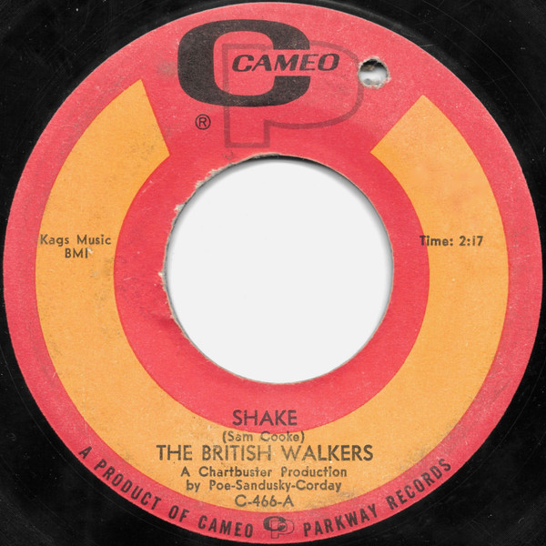

# Shake / That Was Yesterday

By The British Walkers

## Album Data

[Discogs URL](https://www.discogs.com/release/3344569-The-British-Walkers-Shake-/-That-Was-Yesterday)

- Catalog #: C-466
- Label: Cameo
- Formats: Vinyl
- Format: 7", 45 RPM
- Rating: 
- Released: 1967
- Year: 1967
- Release ID: 3344569
- Media condition: Very Good Plus (VG+)
- Sleeve condition: 
- Speed: 45 rpm
- Weight: 

## Album Tracks

| **Position** | **Title** | **Duration** |
|--------------|-----------|--------------|
| A | **Shake** | 2:17 |
| B | **That Was Yesterday** | 2:24 |

## Artist Roles

| **Name** | **Role** |
|----------|----------|
| **Bobby Poe** | Producer |
| **Mitch Corday** | Producer |
| **Vernon Sandusky** | Producer |

## See also

- 
