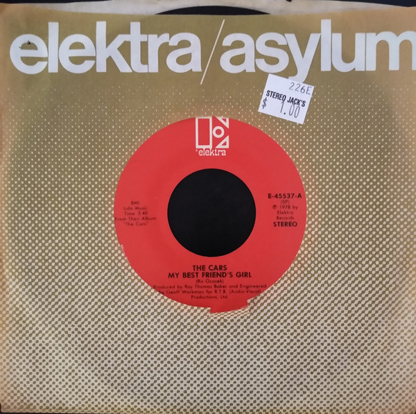

# My Best Friend's Girl

By The Cars

## Album Data

[Discogs URL](https://www.discogs.com/release/3055175-The-Cars-My-Best-Friend's-Girl)

- Catalog #: E-45537
- Label: Elektra
- Format: 7", Single
- Rating: 
- Released: 1978
- Release ID: 3055175
- Media condition: Very Good Plus (VG+)
- Sleeve condition: Very Good (VG)
- Speed: 45 rpm
- Weight: 

## See also

- [Just What I Needed](Just_What_I_Needed.md)
