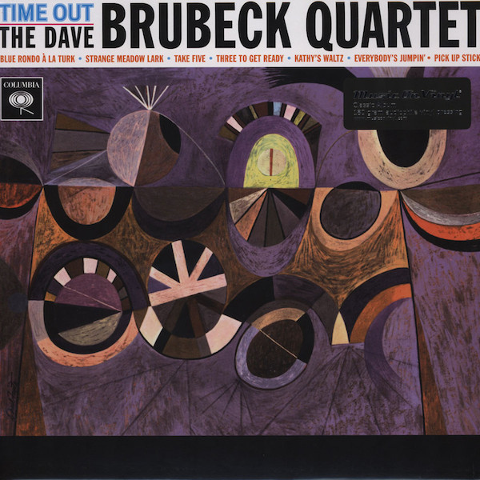

# Time Out

By The Dave Brubeck Quartet

## Album Data

[Discogs URL](https://www.discogs.com/release/2528077-The-Dave-Brubeck-Quartet-Time-Out)

- Catalog #: 88697269441, 88697 26944 1, MOVLP038
- Label: Columbia, Columbia, Music On Vinyl
- Format: LP, Album, RE, RM, 180
- Rating: 
- Released: 2010
- Release ID: 2528077
- Media condition: Mint (M)
- Sleeve condition: Mint (M)
- Speed: 33 rpm
- Weight: 180 gram

