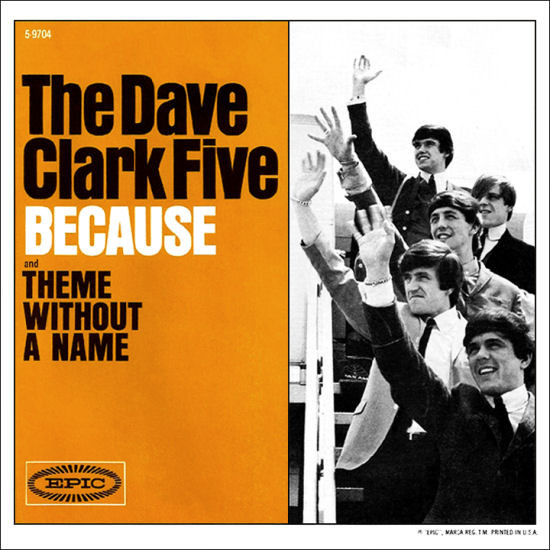

# Because / Theme Without A Name

By The Dave Clark Five

## Album Data

[Discogs URL](https://www.discogs.com/release/3068311-The-Dave-Clark-Five-Because-/-Theme-Without-A-Name)

- Catalog #: 5-9704
- Label: Epic
- Format: 7", Single, Styrene, Ter
- Rating: 
- Released: 1964
- Release ID: 3068311
- Media condition: Good Plus (G+)
- Sleeve condition: No Cover
- Speed: 45 rpm
- Weight: 

