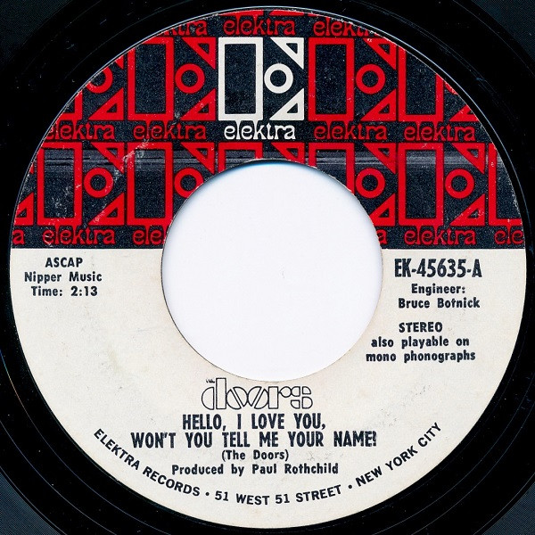

# "Hello, I Love You, Won't You Tell Me Your Name?"

By The Doors

## Album Data

[Discogs URL](https://www.discogs.com/release/2919530-The-Doors-"Hello,-I-Love-You,-Won't-You-Tell-Me-Your-Name?")

- Catalog #: EK-45635
- Label: Elektra
- Format: 7", Styrene, Ter
- Rating: 
- Released: 1968
- Release ID: 2919530
- Media condition: Very Good Plus (VG+)
- Sleeve condition: 
- Speed: 45 rpm
- Weight: 

## See also

- ["Alive, She Cried"](Alive__She_Cried.md)
- [L.A. Woman](LA_Woman.md)
- [Live At The Hollywood Bowl](Live_At_The_Hollywood_Bowl.md)
- [Love Me Two Times](Love_Me_Two_Times.md)
- [Strange Days](Strange_Days.md)
- [The Doors](The_Doors.md)
- [The Soft Parade](The_Soft_Parade.md)
