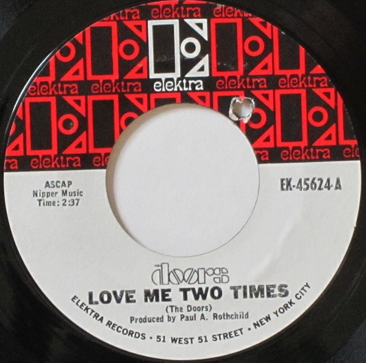

# Love Me Two Times

By The Doors

## Album Data

[Discogs URL](https://www.discogs.com/release/4411429-The-Doors-Love-Me-Two-Times)

- Catalog #: EK-45624
- Label: Elektra
- Format: 7", Single
- Rating: 
- Released: 1967
- Release ID: 4411429
- Media condition: Very Good Plus (VG+)
- Sleeve condition: 
- Speed: 45 rpm
- Weight: 

## Album Tracks

| **Position** | **Title** | **Duration** |
|--------------|-----------|--------------|
| A | **Love Me Two Times** | 2:37 |
| B | **Moonlight Drive** | 2:16 |

## Artist Roles

| **Name** | **Role** |
|----------|----------|
| **Paul A. Rothchild** | Producer |
| **The Doors** | Written-By |

## See also

- ["Alive, She Cried"](Alive__She_Cried.md)
- ["Hello, I Love You, Won't You Tell Me Your Name?"](Hello__I_Love_You__Wont_You_Tell_Me_Your_Name.md)
- [L.A. Woman](LA_Woman.md)
- [Live At The Hollywood Bowl](Live_At_The_Hollywood_Bowl.md)
- [Strange Days](Strange_Days.md)
- [The Doors](The_Doors.md)
- [The Soft Parade](The_Soft_Parade.md)
- [Beets: L.A. Woman](../../Beets/The_Doors/LA_Woman.md)
- [Beets: Light My Fire](../../Beets/The_Doors/Light_My_Fire.md)
- [Beets: Morrison Hotel](../../Beets/The_Doors/Morrison_Hotel.md)
- [Beets: Strange Days](../../Beets/The_Doors/Strange_Days.md)
- [Beets: The Doors](../../Beets/The_Doors/The_Doors.md)
- [Beets: The Soft Parade](../../Beets/The_Doors/The_Soft_Parade.md)
- [Beets: Weird Scenes Inside the Gold Mine](../../Beets/The_Doors/Weird_Scenes_Inside_the_Gold_Mine.md)
- [Roon: L.A. Woman](../../Roon/The_Doors/LA_Woman.md)
- [Roon: Light My Fire](../../Roon/The_Doors/Light_My_Fire.md)
- [Roon: The Soft Parade (50th Anniversary Deluxe Edition)](../../Roon/The_Doors/The_Soft_Parade_50th_Anniversary_Deluxe_Edition.md)
