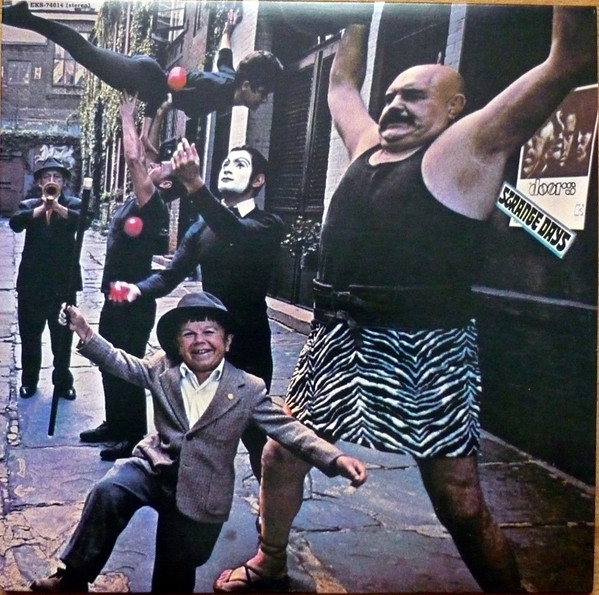

# Strange Days

By The Doors

## Album Data

[Discogs URL](https://www.discogs.com/release/2030783-The-Doors-Strange-Days)

- Catalog #: EKS 74014, RHI-74881-2, R1 519558
- Label: Elektra, Rhino Records (2), Rhino Records (2)
- Format: LP, Album, RE, 180
- Rating: 
- Released: 2009
- Release ID: 2030783
- Media condition: Mint (M)
- Sleeve condition: Mint (M)
- Speed: 33 rpm
- Weight: 180 gram

## See also

- ["Alive, She Cried"](Alive__She_Cried.md)
- ["Hello, I Love You, Won't You Tell Me Your Name?"](Hello__I_Love_You__Wont_You_Tell_Me_Your_Name.md)
- [L.A. Woman](LA_Woman.md)
- [Live At The Hollywood Bowl](Live_At_The_Hollywood_Bowl.md)
- [Love Me Two Times](Love_Me_Two_Times.md)
- [The Doors](The_Doors.md)
- [The Soft Parade](The_Soft_Parade.md)
- [Beets: L.A. Woman](../../Beets/The_Doors/LA_Woman.md)
- [Beets: Light My Fire](../../Beets/The_Doors/Light_My_Fire.md)
- [Beets: Morrison Hotel](../../Beets/The_Doors/Morrison_Hotel.md)
- [Beets: Strange Days](../../Beets/The_Doors/Strange_Days.md)
- [Beets: The Doors](../../Beets/The_Doors/The_Doors.md)
- [Beets: The Soft Parade](../../Beets/The_Doors/The_Soft_Parade.md)
- [Beets: Weird Scenes Inside the Gold Mine](../../Beets/The_Doors/Weird_Scenes_Inside_the_Gold_Mine.md)
- [Roon: L.A. Woman](../../Roon/The_Doors/LA_Woman.md)
- [Roon: Light My Fire](../../Roon/The_Doors/Light_My_Fire.md)
- [Roon: The Soft Parade (50th Anniversary Deluxe Edition)](../../Roon/The_Doors/The_Soft_Parade_50th_Anniversary_Deluxe_Edition.md)
