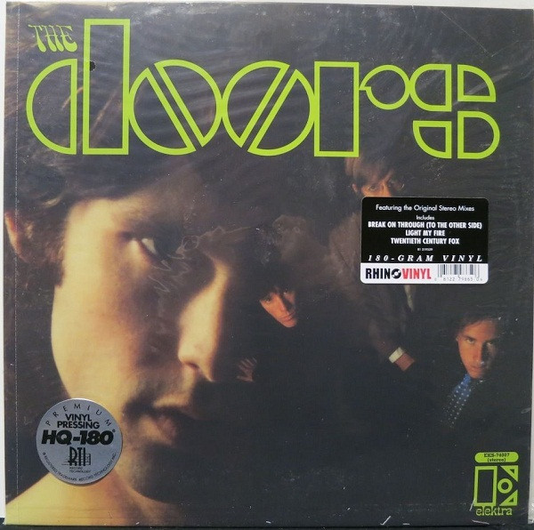

# The Doors

By The Doors

## Album Data

[Discogs URL](https://www.discogs.com/release/2441353-The-Doors-The-Doors)

- Catalog #: EKS-74007, RHI1-74881-1, R1 519559
- Label: Elektra, Rhino Records (2), Rhino Vinyl
- Format: LP, Album, RE, 180
- Rating: 
- Released: 2009
- Release ID: 2441353
- Media condition: Mint (M)
- Sleeve condition: Mint (M)
- Speed: 33 rpm
- Weight: 180 gram

## See also

- ["Alive, She Cried"](Alive__She_Cried.md)
- ["Hello, I Love You, Won't You Tell Me Your Name?"](Hello__I_Love_You__Wont_You_Tell_Me_Your_Name.md)
- [L.A. Woman](LA_Woman.md)
- [Live At The Hollywood Bowl](Live_At_The_Hollywood_Bowl.md)
- [Love Me Two Times](Love_Me_Two_Times.md)
- [Strange Days](Strange_Days.md)
- [The Soft Parade](The_Soft_Parade.md)
