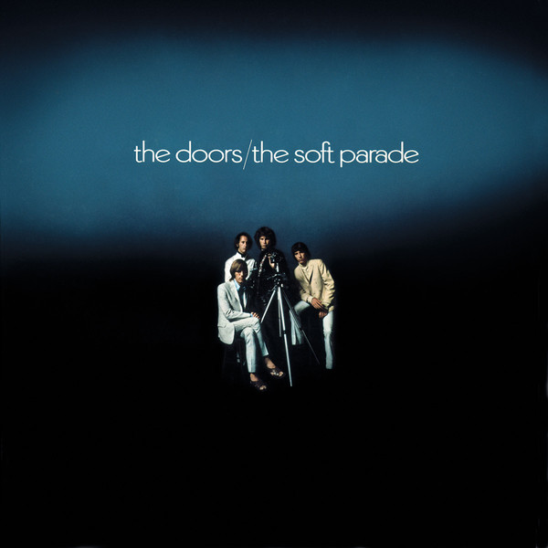

# The Soft Parade

By The Doors

## Album Data

[Discogs URL](https://www.discogs.com/release/3569158-The-Doors-The-Soft-Parade)

- Catalog #: EKS-75005
- Label: Elektra
- Format: LP, Album, RE, AR;
- Rating: 
- Released: 1979
- Release ID: 3569158
- Media condition: Very Good Plus (VG+)
- Sleeve condition: Good Plus (G+)
- Speed: 33 rpm
- Weight: 

## See also

- ["Alive, She Cried"](Alive__She_Cried.md)
- ["Hello, I Love You, Won't You Tell Me Your Name?"](Hello__I_Love_You__Wont_You_Tell_Me_Your_Name.md)
- [L.A. Woman](LA_Woman.md)
- [Live At The Hollywood Bowl](Live_At_The_Hollywood_Bowl.md)
- [Love Me Two Times](Love_Me_Two_Times.md)
- [Strange Days](Strange_Days.md)
- [The Doors](The_Doors.md)
