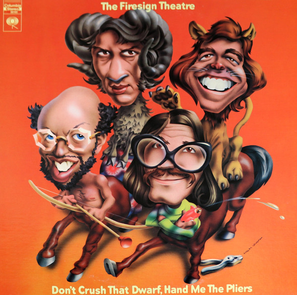

# "Don't Crush That Dwarf, Hand Me The Pliers"

By The Firesign Theatre

## Album Data

[Discogs URL](https://www.discogs.com/release/4952021-The-Firesign-Theatre-"Don't-Crush-That-Dwarf,-Hand-Me-The-Pliers")

- Catalog #: PC 30102
- Label: Columbia
- Format: LP, Album
- Rating: 
- Released: 0
- Release ID: 4952021
- Media condition: Very Good Plus (VG+)
- Sleeve condition: Very Good Plus (VG+)
- Speed: 33 rpm
- Weight: 

## See also

- [Forward Into The Past ( An Anthology)](Forward_Into_The_Past__An_Anthology.md)
- [I Think We're All Bozos On This Bus](I_Think_Were_All_Bozos_On_This_Bus.md)
- [The Tale Of The Giant Rat Of Sumatra](The_Tale_Of_The_Giant_Rat_Of_Sumatra.md)
