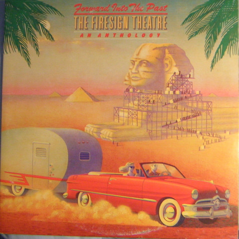

# Forward Into The Past ( An Anthology)

By The Firesign Theatre

## Album Data

[Discogs URL](https://www.discogs.com/release/1444913-The-Firesign-Theatre-Forward-Into-The-Past-(-An-Anthology))

- Catalog #: PG 34391
- Label: Columbia
- Formats: Vinyl, Terre Haute Pressing, Gatefold
- Format: 2xLP, Comp, Ter
- Rating: 
- Released: 1976
- Year: 1976
- Release ID: 1444913
- Media condition: Very Good Plus (VG+)
- Sleeve condition: Very Good Plus (VG+)
- Speed: 33 rpm
- Weight: 

## Album Tracks

| **Position** | **Title** | **Duration** |
|--------------|-----------|--------------|
| A1 | **Station Break** | 2:13 |
| A2 | **Happy Hour News** | 4:23 |
| A3 | **Ralph Spoilsport Motors** | 4:22 |
| A4 | **Beat The Reaper** | 2:52 |
| A5 | **Let's Eat** | 5:25 |
| A6 | **High School Madness** | 6:43 |
| B1 | **Toad Away** | 3:19 |
| B2 | **Not Quite The Solution He Expected** | 8:35 |
| B3 | **Joe Beets Meets Hemlock Stones** | 2:13 |
| B4 | **W. C. Fields Forever** | 7:40 |
| B5 | **Dr. Whiplash** | 3:26 |
| C1 | **The Further Adventures Of Nick Danger** | 28:02 |
| D1 | **Back From The Shadows** | 5:56 |
| D2 | **Mr. President** | 2:46 |
| D3 | **Papoon For President** | 4:50 |
| D4 | **Government Training Film** | 3:20 |
| D5 | **Mark Time!** | 3:52 |
| D6 | **Forward,  Into The Past** | 6:00 |

## Artist Roles

| **Name** | **Role** |
|----------|----------|
| **Dick Wingate** | Coordinator [Album Coordinator], Edited By |
| **Andy Engel** | Design |
| **John O'Leary (5)** | Painting [Cover Painting] |
| **Bill Driml** | Producer |
| **Cyrus Faryar** | Producer |
| **Gary Usher** | Producer |
| **James William Guercio** | Producer |
| **The Firesign Theatre** | Producer |

## See also

- ["Don't Crush That Dwarf, Hand Me The Pliers"](Dont_Crush_That_Dwarf__Hand_Me_The_Pliers.md)
- [I Think We're All Bozos On This Bus](I_Think_Were_All_Bozos_On_This_Bus.md)
- [The Tale Of The Giant Rat Of Sumatra](The_Tale_Of_The_Giant_Rat_Of_Sumatra.md)
