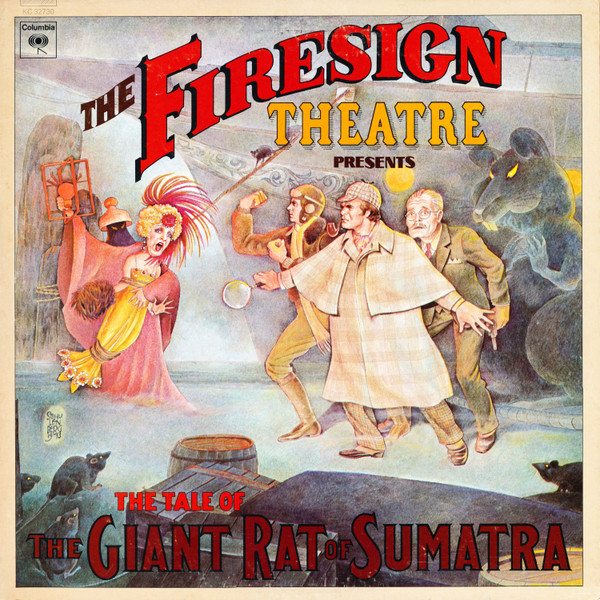

# The Tale Of The Giant Rat Of Sumatra

By The Firesign Theatre

## Album Data

[Discogs URL](https://www.discogs.com/release/7075176-The-Firesign-Theatre-The-Tale-Of-The-Giant-Rat-Of-Sumatra)

- Catalog #: KC 32730
- Label: Columbia
- Format: LP, Album, San
- Rating: 
- Released: 1974
- Release ID: 7075176
- Media condition: Very Good Plus (VG+)
- Sleeve condition: Very Good Plus (VG+)
- Speed: 33 rpm
- Weight: 

## Album Tracks

| **Position** | **Title** | **Duration** |
|--------------|-----------|--------------|
|  | **Part One - London** |  |
| A1 | **Chapter 1 - Not Quite The Solution He Expected** | 8:39 |
| A2 | **Chapter 2 - An Outrageously Disgusting Disguise** | 5:09 |
| A3 | **Chapter 3 - Where There's Smoke, There's Work** | 5:40 |
|  | **Part Two - Chicago** |  |
| B1 | **Chapter 4 - Where Did Jonas Go When The Lights Went Out?** | 7:07 |
| B2 | **Chapter 5 - Pickles Down The Rat Hole!** | 6:13 |
| B3 | **Chapter 6 - The Electrician Exposes Himself!** | 9:06 |

## Artist Roles

| **Name** | **Role** |
|----------|----------|
| **Nisan Eventoff** | Design |
| **Pete Abbott** | Engineer |
| **Steve Francisco** | Engineer |
| **Bob Schulenberg** | Illustration [Cover] |
| **Keith Sheridan** | Typography [Hand Lettering] |
| **The Firesign Theatre** | Written-By, Performer [Performed By], Producer |

## See also

- ["Don't Crush That Dwarf, Hand Me The Pliers"](Dont_Crush_That_Dwarf__Hand_Me_The_Pliers.md)
- [Forward Into The Past ( An Anthology)](Forward_Into_The_Past__An_Anthology.md)
- [I Think We're All Bozos On This Bus](I_Think_Were_All_Bozos_On_This_Bus.md)
