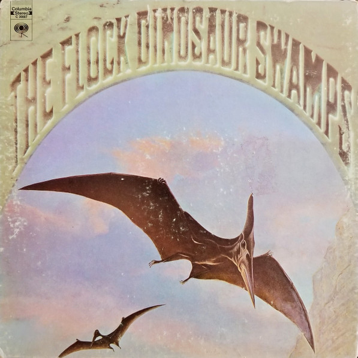

# Dinosaur Swamps

By The Flock

## Album Data

[Discogs URL](https://www.discogs.com/release/1149540-The-Flock-Dinosaur-Swamps)

- Catalog #: C 30007
- Label: Columbia
- Formats: Vinyl, Gatefold
- Format: LP, Album, Gat
- Rating: 
- Released: 1970
- Year: 1970
- Release ID: 1149540
- Media condition: Very Good Plus (VG+)
- Sleeve condition: Very Good Plus (VG+)
- Speed: 33 rpm
- Weight: 

## Album Tracks

| **Position** | **Title** | **Duration** |
|--------------|-----------|--------------|
| A1 | **Green Slice** | 2:00 |
| A2 | **Big Bird** | 5:52 |
| A3 | **Hornschmeyer's Island** | 7:27 |
| A4 | **Lighthouse** | 5:20 |
| B1 | **Crabfoot** | 8:15 |
| B2 | **Mermaid** | 4:53 |
| B3 | **Uranian Sircus** | 7:12 |

## Artist Roles

| **Name** | **Role** |
|----------|----------|
| **Don Meehan** | Engineer |
| **Don Puluse** | Engineer |
| **Aaron Russo** | Management |
| **John McClure** | Producer |
| **The Flock** | Written-By |

## See also

- 
- [Beets: Dinosaur Swamps](../../Beets/The_Flock/Dinosaur_Swamps.md)
- [Roon: Dinosaur Swamps (Expanded Edition)](../../Roon/The_Flock/Dinosaur_Swamps_Expanded_Edition.md)
- [Roon: The Flock (Expanded Edition)](../../Roon/The_Flock/The_Flock_Expanded_Edition.md)
