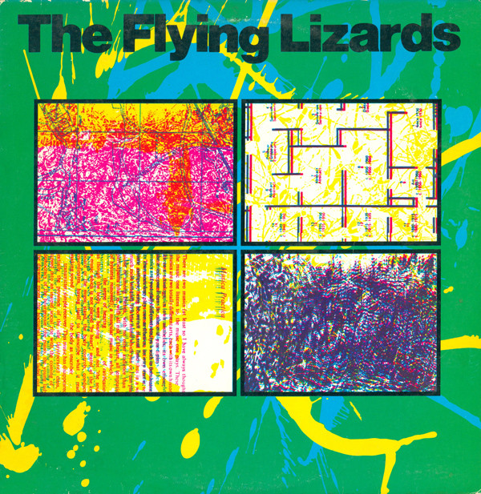

# The Flying Lizards

By The Flying Lizards

## Album Data

[Discogs URL](https://www.discogs.com/release/6177512-The-Flying-Lizards-The-Flying-Lizards)

- Catalog #: VA 13137
- Label: Virgin
- Format: LP, Album, MO 
- Rating: 
- Released: 1979
- Release ID: 6177512
- Media condition: Very Good Plus (VG+)
- Sleeve condition: Very Good Plus (VG+)
- Speed: 33 rpm
- Weight: 

## Album Tracks

| **Position** | **Title** | **Duration** |
|--------------|-----------|--------------|
| A1 | **Der Song Von Mandelay** | 2:27 |
| A2 | **Her Story** | 4:37 |
| A3 | **TV** | 3:51 |
| A4 | **Russia** | 6:11 |
| A5 | **Summertime Blues** | 3:09 |
| B1 | **Money (That's What I Want)** | 5:52 |
| B2 | **The Flood** | 4:57 |
| B3 | **Trouble** | 2:46 |
| B4 | **Events During Flood** | 3:25 |
| B5 | **The Window** | 4:52 |

## Artist Roles

| **Name** | **Role** |
|----------|----------|
| **Laurie-Rae Chamberlain** | Artwork [Xerography] |
| **Dave Hunt** | Engineer |
| **David Cunningham** | Engineer |
| **Richard Rayner-Canham** | Photography By |
| **David Cunningham** | Producer |

## See also

- 
