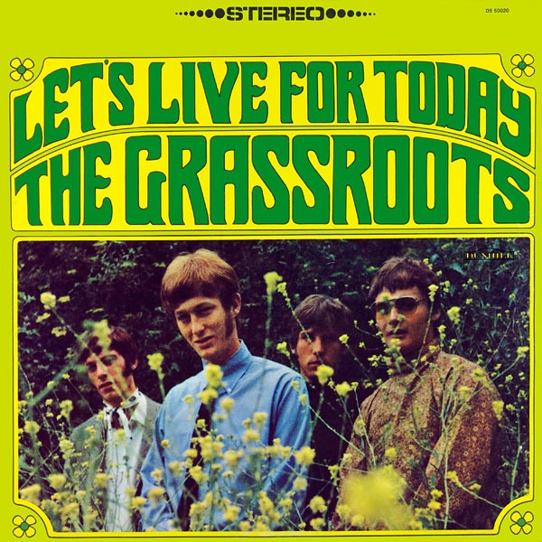

# Let's Live For Today

By The Grass Roots

## Album Data

[Discogs URL](https://www.discogs.com/release/2198501-The-Grass-Roots-Let's-Live-For-Today)

- Catalog #: DS 50020
- Label: Dunhill
- Formats: Vinyl
- Format: LP, Album, Stereo
- Rating: 
- Released: 1967
- Year: 1967
- Release ID: 2198501
- Media condition: Very Good Plus (VG+)
- Sleeve condition: Very Good Plus (VG+)
- Speed: 33 rpm
- Weight: 

## Album Tracks

| **Position** | **Title** | **Duration** |
|--------------|-----------|--------------|
| A1 | **Things I Should Have Said** | 2:30 |
| A2 | **Wake Up, Wake Up** | 2:50 |
| A3 | **Tip Of My Tongue** | 2:29 |
| A4 | **Is It Any Wonder** | 2:42 |
| A5 | **Let's Live For Today** | 2:35 |
| A6 | **Beatin' Round The Bush** | 2:30 |
| B1 | **Out Of Touch** | 2:50 |
| B2 | **Won't You See Me** | 2:56 |
| B3 | **Where Were You When I Needed You** | 2:59 |
| B4 | **No Exit** | 2:34 |
| B5 | **This Precious Time** | 3:01 |
| B6 | **House Of Stone** | 2:40 |

## Artist Roles

| **Name** | **Role** |
|----------|----------|
| **Philip Schwartz** | Cover, Design, Photography |
| **Chuck Britz** | Engineer |
| **Warren Entner** | Photography |
| **P.F. Sloan** | Producer |
| **Steve Barri** | Producer |

## See also

- [Temptation Eyes](Temptation_Eyes.md)
- [Roon: 20th Century Masters](../../Roon/The_Grass_Roots/20th_Century_Masters-_The_Millennium_Collection-_Best_Of_The_Grass_Roots.md)
- [Roon: Let's Live For Today](../../Roon/The_Grass_Roots/Lets_Live_For_Today.md)
- [Roon: Symphonic Hits (Re-Recorded)](../../Roon/The_Grass_Roots/Symphonic_Hits_Re-Recorded.md)
- [Roon: Temptation Eyes](../../Roon/The_Grass_Roots/Temptation_Eyes.md)
