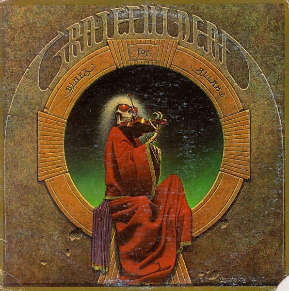

# Blues For Allah

By The Grateful Dead

## Album Data

[Discogs URL](https://www.discogs.com/release/1662275-The-Grateful-Dead-Blues-For-Allah)

- Catalog #: GD-LA494-G
- Label: Grateful Dead Records
- Format: LP, Album, Jac
- Rating: 
- Released: 1975
- Release ID: 1662275
- Media condition: Good (G)
- Sleeve condition: Fair (F)
- Speed: 33 rpm
- Weight: 

## Album Tracks

| **Position** | **Title** | **Duration** |
|--------------|-----------|--------------|
| A1a | **Help On The Way** | 3:15 |
| A1b | **Slipknot!** | 4:03 |
| A2 | **Franklin's Tower (Roll Away The Dew)** | 4:37 |
| A3a | **King Solomon's Marbles** | 1:55 |
| A3b | **Stronger Than Dirt Or Milkin' The Turkey** | 3:25 |
| A4 | **The Music Never Stopped** | 4:35 |
| B1 | **Crazy Fingers** | 6:41 |
| B2 | **Sage & Spirit** | 3:07 |
| B3a | **Blues For Allah** | 3:21 |
| B3b | **Sand Castles & Glass Camels** | 5:26 |
| B3c | **Unusual Occurances In The Desert** | 3:48 |

## See also

- [Built To Last](Built_To_Last.md)
- [Go To Heaven](Go_To_Heaven.md)
- ["History Of The Grateful Dead, Vol. 1 (Bear's Choice)"](History_Of_The_Grateful_Dead__Vol_1_Bears_Choice.md)
- ["P.N.E. Garden Aud., Vancouver, Canada, July 29 1966"](PNE_Garden_Aud__Vancouver__Canada__July_29_1966.md)
- [Terrapin Station](Terrapin_Station.md)
- [Workingman's Dead](Workingmans_Dead.md)
