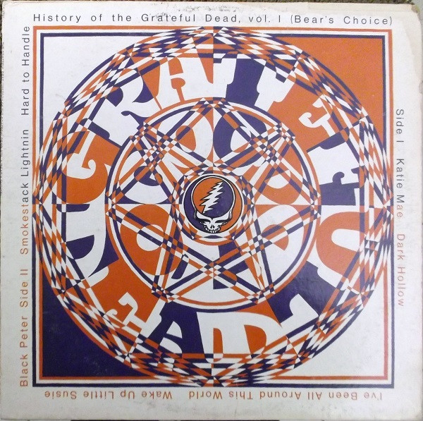

# "History Of The Grateful Dead, Vol. 1 (Bear's Choice)"

By The Grateful Dead

## Album Data

[Discogs URL](https://www.discogs.com/release/1893762-The-Grateful-Dead-"History-Of-The-Grateful-Dead,-Vol.-1-(Bear's-Choice)")

- Catalog #: BS 2721
- Label: Warner Bros. Records
- Format: LP, Album
- Rating: 
- Released: 1973
- Release ID: 1893762
- Media condition: Very Good (VG)
- Sleeve condition: Very Good (VG)
- Speed: 33 rpm
- Weight: 

## See also

- [Blues For Allah](Blues_For_Allah.md)
- [Built To Last](Built_To_Last.md)
- [Go To Heaven](Go_To_Heaven.md)
- ["P.N.E. Garden Aud., Vancouver, Canada, July 29 1966"](PNE_Garden_Aud__Vancouver__Canada__July_29_1966.md)
- [Terrapin Station](Terrapin_Station.md)
- [Workingman's Dead](Workingmans_Dead.md)
