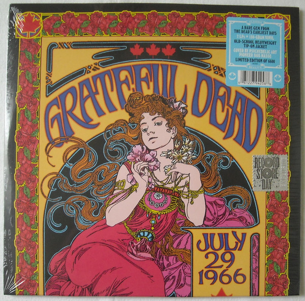

# "P.N.E. Garden Aud., Vancouver, Canada, July 29 1966"

By The Grateful Dead

## Album Data

[Discogs URL](https://www.discogs.com/release/10174824-The-Grateful-Dead-"P.N.E.-Garden-Aud.,-Vancouver,-Canada,-July-29-1966")

- Catalog #: R1-557457
- Label: Rhino Records (2)
- Format: 2xLP, Ltd, 180
- Rating: 
- Released: 2017
- Release ID: 10174824
- Media condition: Mint (M)
- Sleeve condition: Mint (M)
- Speed: 33 rpm
- Weight: 180 gram

## Album Tracks

| **Position** | **Title** | **Duration** |
|--------------|-----------|--------------|
|  | **7/29/1966** |  |
| A1 | **Standing On The Corner** | 3:23 |
| A2 | **I Know You Rider** | 3:14 |
| A3 | **Next Time You See Me** | 3:37 |
| A4 | **Sittin' On Top Of The World** | 3:47 |
| A5 | **You Don't Have To Ask** | 5:14 |
| B1 | **Big Boss Man** | 4:16 |
| B2 | **Stealin'** | 3:37 |
| B3 | **Cardboard Cowboy** | 2:56 |
| B4 | **It's All Over Now, Baby Blue** | 5:23 |
| B5 | **Cream Puff War** | 7:52 |
| C1 | **Viola Lee Blues** | 10:03 |
| C2 | **Beat It On Down The Line** | 2:47 |
| C3 | **Good Mornin' Little Schoolgirl** | 5:47 |
|  | **7/30/1966** |  |
| D1 | **Cold Rain And Snow** | 3:14 |
| D2 | **One Kind Favor** | 4:23 |
| D3 | **Hey Little One** | 5:39 |
| D4 | **New, New Minglewood Blues** | 3:23 |

## See also

- [Blues For Allah](Blues_For_Allah.md)
- [Built To Last](Built_To_Last.md)
- [Go To Heaven](Go_To_Heaven.md)
- ["History Of The Grateful Dead, Vol. 1 (Bear's Choice)"](History_Of_The_Grateful_Dead__Vol_1_Bears_Choice.md)
- [Terrapin Station](Terrapin_Station.md)
- [Workingman's Dead](Workingmans_Dead.md)
