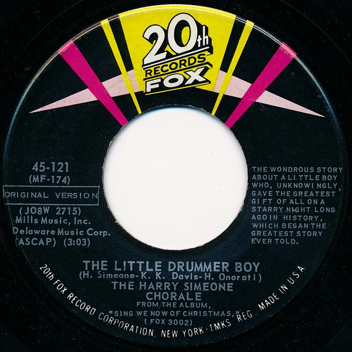

# The Little Drummer Boy / Die Lorelei

By The Harry Simeone Chorale / The Voices Of The Junior Chorale

## Album Data

[Discogs URL](https://www.discogs.com/release/2304132-The-Harry-Simeone-Chorale-/-The-Voices-Of-The-Junior-Chorale-The-Little-Drummer-Boy-/-Die-Lorelei)

- Catalog #: 45-121
- Label: 20th Fox
- Formats: Vinyl
- Format: 7", Single
- Rating: 
- Released: 1958
- Year: 1958
- Release ID: 2304132
- Media condition: Very Good Plus (VG+)
- Sleeve condition: Very Good Plus (VG+)
- Speed: 45 rpm
- Weight: 

## Album Tracks

| **Position** | **Title** | **Duration** |
|--------------|-----------|--------------|
| A | **The Little Drummer Boy** | 3:03 |
| B | **Die Lorelei** | 2:15 |

## Artist Roles

| **Name** | **Role** |
|----------|----------|
| **Irv Docktor** | Illustration |

## See also

- 
