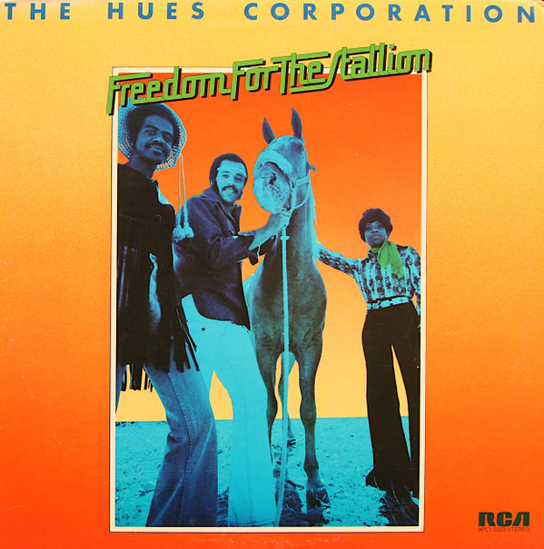

# Freedom For The Stallion

By The Hues Corporation

## Album Data

[Discogs URL](https://www.discogs.com/release/715385-The-Hues-Corporation-Freedom-For-The-Stallion)

- Catalog #: APL1-0323
- Label: RCA Victor
- Formats: Vinyl, Indianapolis Press
- Format: LP, Album, Ind
- Rating: 
- Released: 1973
- Year: 1973
- Release ID: 715385
- Media condition: Very Good Plus (VG+)
- Sleeve condition: Very Good Plus (VG+)
- Speed: 33 rpm
- Weight: 

## Album Tracks

| **Position** | **Title** | **Duration** |
|--------------|-----------|--------------|
| A1 | **Bound On A Reason** | 3:15 |
| A2 | **Off My Cloud** | 4:16 |
| A3 | **All Goin' Down Together** | 2:51 |
| A4 | **Rock The Boat** | 3:22 |
| A5 | **Freedom For The Stallion** | 4:00 |
| B1 | **The Family** | 3:09 |
| B2 | **Go To The Poet** | 2:51 |
| B3 | **Salvation Lady (1-3-5)** | 3:18 |
| B4 | **Live A Lie** | 2:13 |
| B5 | **Miracle Maker (Sweet Soul Shaker)** | 3:16 |

## Artist Roles

| **Name** | **Role** |
|----------|----------|
| **D'Arneill Pershing** | Arranged By |
| **Gene Page** | Arranged By |
| **Perry Botkin Jr.** | Arranged By |
| **Tom Sellers** | Arranged By |
| **The Hues Corporation** | Arranged By [Vocals] |
| **Wally Holmes** | Arranged By [Vocals] |
| **Frank Mulvey** | Art Direction [Art Director] |
| **William Green** | Baritone Saxophone |
| **David Hungate** | Bass |
| **Joe Osborn** | Bass |
| **Wilton Felder** | Bass |
| **Edgar Lustgarten (2)** | Cello |
| **Chino Valdes** | Congas |
| **Hal Blaine** | Drums |
| **Jim Gordon** | Drums |
| **Ron Tutt** | Drums |
| **Grover Helsley** | Engineer [Recording] |
| **Pete Abbott** | Engineer [Recording] |
| **Al Casey (2)** | Guitar |
| **Dennis Budimir** | Guitar |
| **Larry Carlton** | Guitar |
| **Louie Shelton** | Guitar |
| **Joe Sample** | Keyboards |
| **Holmes/Ratner Entertainment** | Management |
| **Gary Coleman** | Percussion |
| **Emerson-Loew** | Photography By |
| **John Florez** | Producer |
| **Kent Tunks** | Technician |
| **Steve Francisco** | Technician |
| **Charles Loper** | Trombone |
| **Lew McCreary** | Trombone |
| **Bud Brisbois** | Trumpet |
| **Chuck Findley** | Trumpet |
| **Paul Hubinon** | Trumpet |
| **David Schwartz** | Viola |
| **Harry Bluestone** | Violin |
| **Israel Baker** | Violin |
| **James Getzoff** | Violin |
| **Sidney Sharp** | Violin |
| **Ann Kelley** | Vocals |
| **Fleming Williams** | Vocals |
| **St. Clair Lee** | Vocals |

## See also

- 
- [Beets: Freedom for the Stallion](../../Beets/The_Hues_Corporation/Freedom_for_the_Stallion.md)
