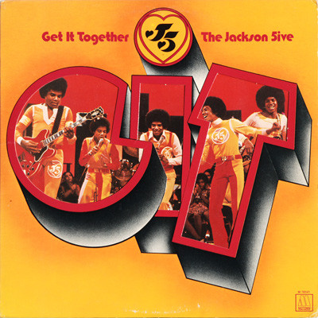

# Get It Together

By The Jackson 5

## Album Data

[Discogs URL](https://www.discogs.com/release/4541597-The-Jackson-5-Get-It-Together)

- Catalog #: M 783V1, M-783V1
- Label: Motown, Motown
- Format: LP, Album, Hol
- Rating: 
- Released: 1973
- Release ID: 4541597
- Media condition: Very Good Plus (VG+)
- Sleeve condition: Good (G)
- Speed: 33 rpm
- Weight: 

## Album Tracks

| **Position** | **Title** | **Duration** |
|--------------|-----------|--------------|
| A1 | **Get It Together** | 2:47 |
| A2 | **Don't Say Good Bye Again** | 3:34 |
| A3 | **Reflections** | 3:05 |
| A4 | **Hum Along And Dance** | 8:14 |
| B1 | **Mama I Gotta Brand New Thing (Don't Say No)** | 7:14 |
| B2 | **It's Too Late To Change The Time** | 4:00 |
| B3 | **You Need Love Like I Do (Don't You?)** | 4:25 |
| B4 | **Dancing Machine** | 3:12 |

## Artist Roles

| **Name** | **Role** |
|----------|----------|
| **James Anthony Carmichael** | Arranged By [Vocals] |
| **Suzee Ikeda** | Coordinator [& Production Assistant] |
| **AGI (4)** | Design |
| **Desmond Strobel** | Design |
| **Berry Gordy** | Executive-Producer |
| **Russ Terrana** | Mixed By |
| **Jim Britt** | Photography By |
| **Hal Davis** | Producer |
| **Art Stewart** | Recorded By |
| **Russ Terrana** | Recorded By |

## See also

- [Greatest Hits](Greatest_Hits.md)
