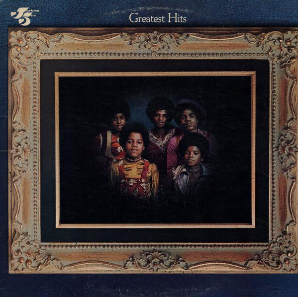

# Greatest Hits

By The Jackson 5

## Album Data

[Discogs URL](https://www.discogs.com/release/3577899-The-Jackson-5-Greatest-Hits)

- Catalog #: M 741L, M6-741S1
- Label: Motown, Motown
- Format: LP, Comp
- Rating: 
- Released: 1971
- Release ID: 3577899
- Media condition: Very Good Plus (VG+)
- Sleeve condition: Very Good (VG)
- Speed: 33 rpm
- Weight: 

## See also

- [Get It Together](Get_It_Together.md)
