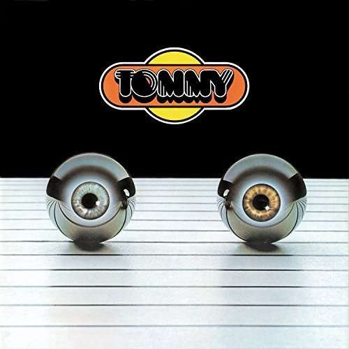

# Tommy - As Performed By The London Symphony Orchestra & Chambre Choir With Guest Soloists

By The London Symphony Orchestra

## Album Data

[Discogs URL](https://www.discogs.com/release/7871843-The-London-Symphony-Orchestra-Tommy---As-Performed-By-The-London-Symphony-Orchestra-&-Chambre-Choir-With-Guest-Soloists)

- Catalog #: ODE-00005-1
- Label: Ode Records (2)
- Format: 2xLP, Album, RE
- Rating: 
- Released: 2015
- Release ID: 7871843
- Media condition: Mint (M)
- Sleeve condition: Mint (M)
- Speed: 33 rpm
- Weight: 180 gram

## Album Tracks

| **Position** | **Title** | **Duration** |
|--------------|-----------|--------------|
| A1 | **Overture** |  |
| A2 | **It's A Boy** |  |
| A3 | **1921** |  |
| A4 | **Amazing Journey** |  |
| A5 | **Sparks** |  |
| A6 | **Eyesight To The Blind** |  |
| A7 | **Christmas** |  |
| B1 | **Cousin Kevin** |  |
| B2 | **The Acid Queen** |  |
| B3 | **Underture** |  |
| B4 | **Do You Think It's All Right** |  |
| B5 | **Fiddle About** |  |
| B6 | **Pin Ball Wizard** |  |
| C1 | **There’s A Doctor I’ve Found** |  |
| C2 | **Go To The Mirror Boy** |  |
| C3 | **Tommy Can You Hear Me?** |  |
| C4 | **Smash The Mirror** |  |
| C5 | **I'm Free** |  |
| C6 | **Miracle Cure** |  |
| C7 | **Sensation** |  |
| D1 | **Sally Simpson** |  |
| D2 | **Welcome** |  |
| D3 | **Tommy's Holiday Camp** |  |
| D4 | **We're Not Gonna Take It** |  |
| D5 | **See Me, Feel Me** |  |

## Artist Roles

| **Name** | **Role** |
|----------|----------|
| **Lou Reizner** | Producer |

## See also

- 
- [Beets: Zappa Vol. 1](../../Beets/The_London_Symphony_Orchestra/Zappa_Vol_1.md)
