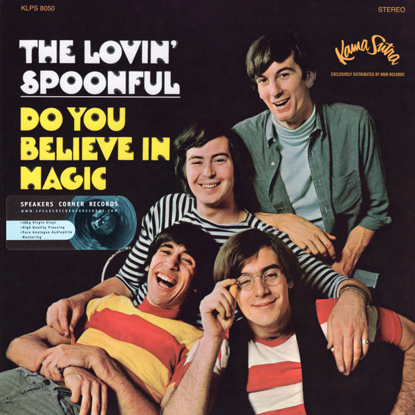

# Do You Believe In Magic

By The Lovin' Spoonful

## Album Data

[Discogs URL](https://www.discogs.com/release/2807324-The-Lovin'-Spoonful-Do-You-Believe-In-Magic)

- Catalog #: KLPS 8050
- Label: Speakers Corner Records
- Formats: Vinyl, 180 gram
- Format: LP, Album, RE, 180
- Rating: 
- Released: 2011
- Year: 1965
- Release ID: 2807324
- Media condition: Mint (M)
- Sleeve condition: Mint (M)
- Speed: 33 rpm
- Weight: 

## Album Tracks

| **Position** | **Title** | **Duration** |
|--------------|-----------|--------------|
| A1 | **Do You Believe In Magic** | 2:04 |
| A2 | **Blues In The Bottle** | 2:10 |
| A3 | **Sportin' Life** | 4:02 |
| A4 | **My Gal** | 2:30 |
| A5 | **You Baby** | 2:55 |
| A6 | **Fishin' Blues** | 1:58 |
| B1 | **Did You Ever Have To Make Up Your Mind** | 2:00 |
| B2 | **Wild About My Lovin'** | 2:38 |
| B3 | **Other Side Of This Life** | 2:30 |
| B4 | **Younger Girl** | 2:23 |
| B5 | **On The Road Again** | 1:52 |
| B6 | **Night Owl Blues** | 3:00 |

## Artist Roles

| **Name** | **Role** |
|----------|----------|
| **Joel Tanner** | Design [Cover] |
| **Joe Butler** | Drums |
| **Steve Boone** | Electric Bass |
| **Val Valentin** | Engineer [Director Of Engineering] |
| **Zal Yanovsky** | Lead Guitar |
| **Antonia Duren** | Liner Notes |
| **Peter Stampfel** | Liner Notes |
| **Chuck Stewart** | Photography By [Cover] |
| **Erik Jacobsen** | Producer |
| **John Sebastian** | Vocals, Guitar, Autoharp, Harmonica |

## See also

- [Darling Be Home Soon / Darlin' Companion](Darling_Be_Home_Soon_-_Darlin_Companion.md)
- [Daydream](Daydream.md)
- [Hums Of The Lovin' Spoonful](Hums_Of_The_Lovin_Spoonful.md)
- [The Best Of The Lovin' Spoonful](The_Best_Of_The_Lovin_Spoonful.md)
- [Beets: Daydream](../../Beets/The_Lovin_Spoonful/Daydream.md)
