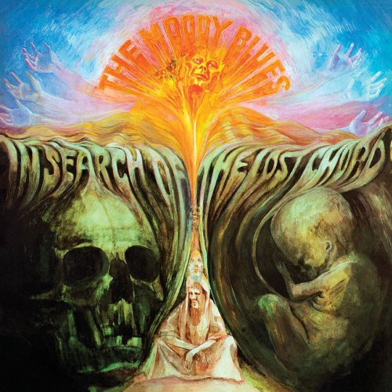

# In Search Of The Lost Chord

By The Moody Blues

## Album Data

[Discogs URL](https://www.discogs.com/release/5767727-The-Moody-Blues-In-Search-Of-The-Lost-Chord)

- Catalog #: FRM-18017
- Label: Deram, Friday Music
- Format: LP, Album, RE, Gat
- Rating: 
- Released: 2014
- Release ID: 5767727
- Media condition: Mint (M)
- Sleeve condition: Mint (M)
- Speed: 33 rpm
- Weight: 180 gram

## See also

- [A Question Of Balance](A_Question_Of_Balance.md)
- [On The Threshold Of A Dream](On_The_Threshold_Of_A_Dream.md)
- [Seventh Sojourn](Seventh_Sojourn.md)
