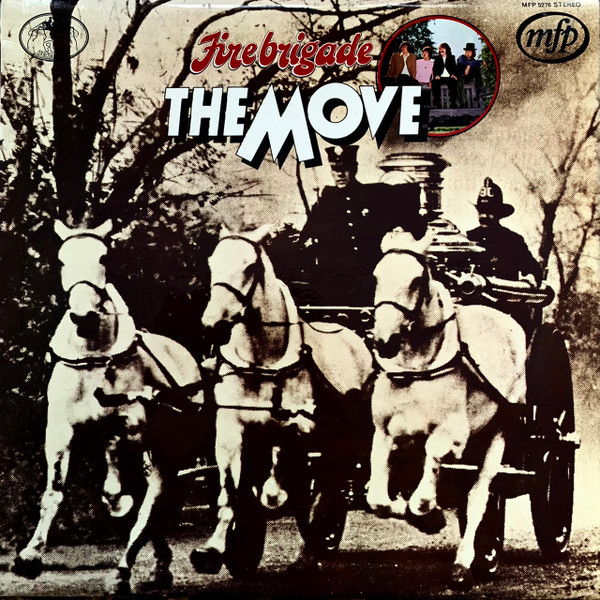

# Fire Brigade

By The Move

## Album Data

[Discogs URL](https://www.discogs.com/release/5519540-The-Move-Fire-Brigade)

- Catalog #: MFP 5276
- Label: Music For Pleasure
- Format: LP, Comp
- Rating: 
- Released: 1972
- Release ID: 5519540
- Media condition: Good (G)
- Sleeve condition: Fair (F)
- Speed: 33 rpm
- Weight: 

## Album Tracks

| **Position** | **Title** | **Duration** |
|--------------|-----------|--------------|
| A1 | **Flowers In The Rain** |  |
| A2 | **(Here We Go Round) The Lemon Tree** |  |
| A3 | **Fire Brigade** |  |
| A4 | **Beautiful Daughter** |  |
| A5 | **Wild Tiger Woman** |  |
| A6 | **Blackberry Way** |  |
| B1 | **Curly** |  |
| B2 | **Omnibus** |  |
| B3 | **Walk Upon The Water** |  |
| B4 | **When Alice Comes Back To The Farm** |  |
| B5 | **Yellow Rainbow** |  |
| B6 | **Brontosaurus** |  |

## See also

- [Looking On](Looking_On.md)
- [Beets: Fire Brigade](../../Beets/The_Move/Fire_Brigade.md)
- [Beets: Live at the Fillmore 1969](../../Beets/The_Move/Live_at_the_Fillmore_1969.md)
- [Beets: Looking On](../../Beets/The_Move/Looking_On.md)
- [Beets: Message From the Country](../../Beets/The_Move/Message_From_the_Country.md)
- [Roon: Shazam](../../Roon/The_Move/Shazam.md)
