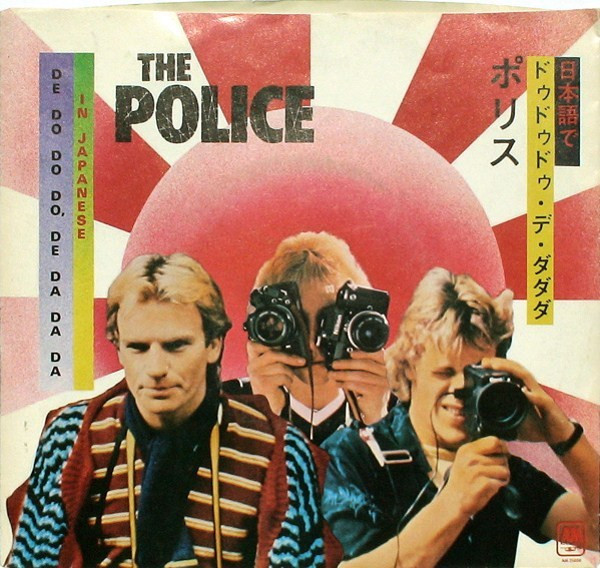

# "De Do Do Do, De Da Da Da (In Japanese)"

By The Police

## Album Data

[Discogs URL](https://www.discogs.com/release/4371521-The-Police-"De-Do-Do-Do,-De-Da-Da-Da-(In-Japanese)")

- Catalog #: AM-25000, 25000-S
- Label: A&M Records, A&M Records
- Format: 7", Single
- Rating: 
- Released: 1981
- Release ID: 4371521
- Media condition: Very Good Plus (VG+)
- Sleeve condition: Very Good Plus (VG+)
- Speed: 45 rpm
- Weight: 

