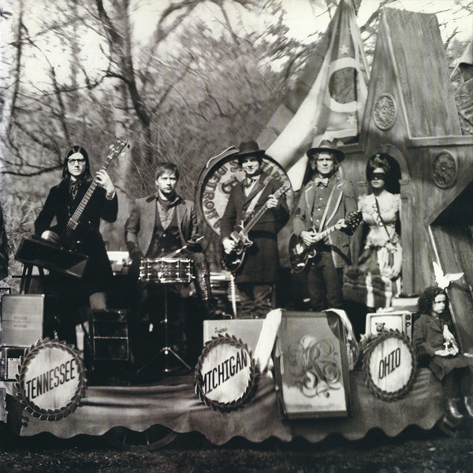

# Consolers Of The Lonely

By The Raconteurs

## Album Data

[Discogs URL](https://www.discogs.com/release/1303295-The-Raconteurs-Consolers-Of-The-Lonely)

- Catalog #: 1-456060, 456060-1
- Label: Warner Bros. Records, Third Man Records
- Format: 2xLP, Album, Tri
- Rating: 
- Released: 2008
- Release ID: 1303295
- Media condition: Mint (M)
- Sleeve condition: Mint (M)
- Speed: 33 rpm
- Weight: 180 gram

## Album Tracks

| **Position** | **Title** | **Duration** |
|--------------|-----------|--------------|
| A1 | **Consoler Of The Lonely** |  |
| A2 | **Salute Your Solution** |  |
| A3 | **You Don't Understand Me** |  |
| A4 | **Old Enough** |  |
| B1 | **The Switch And The Spur** |  |
| B2 | **Hold Up** |  |
| B3 | **Top Yourself** |  |
| C1 | **Many Shades Of Black** |  |
| C2 | **Five On The Five** |  |
| C3 | **Attention** |  |
| C4 | **Pull This Blanket Off** |  |
| D1 | **Rich Kid Blues** |  |
| D2 | **These Stones Will Shout** |  |
| D3 | **Carolina Drama** |  |

## See also

- [Broken Boy Soldiers](Broken_Boy_Soldiers.md)
- [Beets: Broken Boy Soldiers](../../Beets/The_Raconteurs/Broken_Boy_Soldiers.md)
- [Beets: Consolers of the Lonely](../../Beets/The_Raconteurs/Consolers_of_the_Lonely.md)
- [Roon: Broken Boy Soldiers](../../Roon/The_Raconteurs/Broken_Boy_Soldiers.md)
- [Roon: Consolers of the Lonely](../../Roon/The_Raconteurs/Consolers_of_the_Lonely.md)
- [Roon: Help Us Stranger](../../Roon/The_Raconteurs/Help_Us_Stranger.md)
- [Roon: Old Enough (feat. Ricky Skaggs and Ashley Monroe)](../../Roon/The_Raconteurs/Old_Enough_feat_Ricky_Skaggs_and_Ashley_Monroe.md)
- [Roon: Salute Your Solution](../../Roon/The_Raconteurs/Salute_Your_Solution.md)
