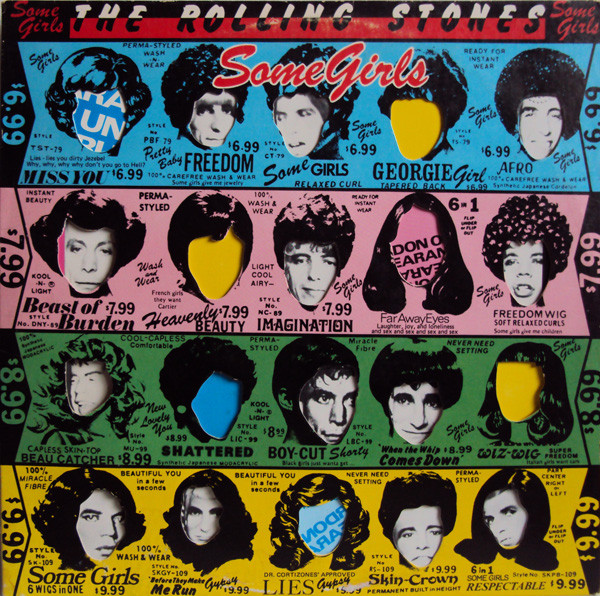

# Some Girls

By The Rolling Stones

## Album Data

[Discogs URL](https://www.discogs.com/release/5403804-The-Rolling-Stones-Some-Girls)

- Catalog #: COC 39108
- Label: Rolling Stones Records
- Format: LP, Album, 2nd
- Rating: 
- Released: 1978
- Release ID: 5403804
- Media condition: Very Good Plus (VG+)
- Sleeve condition: Very Good Plus (VG+)
- Speed: 33 rpm
- Weight: 

## See also

- [12 x 5](12_x_5.md)
- [Aftermath](Aftermath.md)
- [Between The Buttons](Between_The_Buttons.md)
- [England's Newest Hit Makers](Englands_Newest_Hit_Makers.md)
- [Goats Head Soup](Goats_Head_Soup.md)
- [Got Live If You Want It!](Got_Live_If_You_Want_It!.md)
- [It's Only Rock 'N Roll](Its_Only_Rock_N_Roll.md)
- [Jumpin' Jack Flash](Jumpin_Jack_Flash.md)
- [Out Of Our Heads](Out_Of_Our_Heads.md)
- ["Paint It, Black"](Paint_It__Black.md)
- [Steel Wheels](Steel_Wheels.md)
- [Sticky Fingers](Sticky_Fingers.md)
- ["The Rolling Stones, Now!"](The_Rolling_Stones__Now!.md)
- ["Through The Past, Darkly (Big Hits Vol. 2)"](Through_The_Past__Darkly_Big_Hits_Vol_2.md)
