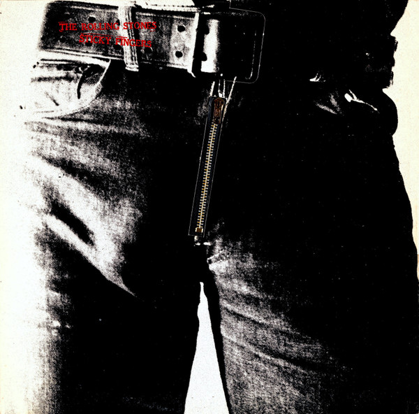

# Sticky Fingers

By The Rolling Stones

## Album Data

[Discogs URL](https://www.discogs.com/release/3635308-The-Rolling-Stones-Sticky-Fingers)

- Catalog #: COC 59100
- Label: Rolling Stones Records
- Format: LP, Album, RP, MO 
- Rating: 
- Released: 1972
- Release ID: 3635308
- Media condition: Very Good Plus (VG+)
- Sleeve condition: Very Good Plus (VG+)
- Speed: 33 rpm
- Weight: 

## Album Tracks

| **Position** | **Title** | **Duration** |
|--------------|-----------|--------------|
| A1 | **Brown Sugar** | 3:50 |
| A2 | **Sway** | 3:45 |
| A3 | **Wild Horses** | 5:41 |
| A4 | **Can't You Hear Me Knocking** | 7:17 |
| A5 | **You Gotta Move** | 2:32 |
| B1 | **Bitch** | 3:42 |
| B2 | **I Got The Blues** | 4:00 |
| B3 | **Sister Morphine** | 5:34 |
| B4 | **Dead Flowers** | 4:05 |
| B5 | **Moonlight Mile** | 5:56 |

## Artist Roles

| **Name** | **Role** |
|----------|----------|
| **Andy Warhol** | Artwork [Cover] |
| **Jimmy Miller** | Producer |
| **Jagger-Richards** | Written-By |

## See also

- [12 x 5](12_x_5.md)
- [Aftermath](Aftermath.md)
- [Between The Buttons](Between_The_Buttons.md)
- [England's Newest Hit Makers](Englands_Newest_Hit_Makers.md)
- [Goats Head Soup](Goats_Head_Soup.md)
- [Got Live If You Want It!](Got_Live_If_You_Want_It!.md)
- [It's Only Rock 'N Roll](Its_Only_Rock_N_Roll.md)
- [Jumpin' Jack Flash](Jumpin_Jack_Flash.md)
- [Out Of Our Heads](Out_Of_Our_Heads.md)
- ["Paint It, Black"](Paint_It__Black.md)
- [Some Girls](Some_Girls.md)
- [Steel Wheels](Steel_Wheels.md)
- ["The Rolling Stones, Now!"](The_Rolling_Stones__Now!.md)
- ["Through The Past, Darkly (Big Hits Vol. 2)"](Through_The_Past__Darkly_Big_Hits_Vol_2.md)
- [Beets: Beggars Banquet](../../Beets/The_Rolling_Stones/Beggars_Banquet.md)
- [Beets: Let It Bleed](../../Beets/The_Rolling_Stones/Let_It_Bleed.md)
- [Beets: Sticky Fingers](../../Beets/The_Rolling_Stones/Sticky_Fingers.md)
- [Beets: Sweet Summer Sun](../../Beets/The_Rolling_Stones/Sweet_Summer_Sun.md)
- [Beets: Their Satanic Majesties Request](../../Beets/The_Rolling_Stones/Their_Satanic_Majesties_Request.md)
- [Roon: Beggars Banquet (50th Anniversary Edition)](../../Roon/The_Rolling_Stones/Beggars_Banquet_50th_Anniversary_Edition.md)
- [Roon: Their Satanic Majesties Request (50th Anniversary Edition) (50th Anniversary Special Edition / Remastered)](../../Roon/The_Rolling_Stones/Their_Satanic_Majesties_Request_50th_Anniversary_Edition_50th_Anniversary_Special_Edition_-_Remastered.md)
- [Roon: Their Satanic Majesties Request (50th Anniversary Special Edition / Remastered)](../../Roon/The_Rolling_Stones/Their_Satanic_Majesties_Request_50th_Anniversary_Special_Edition_-_Remastered.md)
