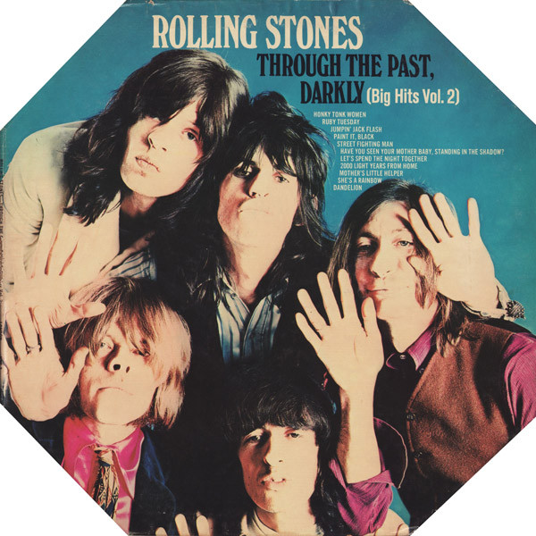

# "Through The Past, Darkly (Big Hits Vol. 2)"

By The Rolling Stones

## Album Data

[Discogs URL](https://www.discogs.com/release/936330-The-Rolling-Stones-"Through-The-Past,-Darkly-(Big-Hits-Vol.-2)")

- Catalog #: NPS-3
- Label: London Records
- Formats: Vinyl, Octagon Gatefold, Pitman Pressing
- Format: LP, Comp, Oct
- Rating: 
- Released: 1969
- Year: 1969
- Release ID: 936330
- Media condition: Very Good (VG)
- Sleeve condition: Very Good (VG)
- Speed: 33 rpm
- Weight: 

## Album Tracks

| **Position** | **Title** | **Duration** |
|--------------|-----------|--------------|
| A1 | **Paint It, Black** | 3:20 |
| A2 | **Ruby Tuesday** | 3:12 |
| A3 | **She's A Rainbow** | 4:35 |
| A4 | **Jumpin' Jack Flash** | 3:40 |
| A5 | **Mother's Little Helper** | 2:40 |
| A6 | **Let's Spend The Night Together** | 3:29 |
| B1 | **Honky Tonk Women** | 3:03 |
| B2 | **Dandelion** | 3:56 |
| B3 | **2,000 Light Years From Home** | 4:45 |
| B4 | **Have You Seen Your Mother Baby, Standing In The Shadow?** | 2:33 |
| B5 | **Street Fighting Man** | 3:10 |

## Artist Roles

| **Name** | **Role** |
|----------|----------|
| **The Rolling Stones** | Arranged By |
| **Sam Feldman** | Lacquer Cut By |
| **Ethan Russell** | Photography By [Cover And Liner Photographs] |
| **Andrew Loog Oldham** | Producer |
| **Jimmy Miller** | Producer |
| **The Rolling Stones** | Producer |
| **Jagger-Richards** | Written-By |

## See also

- [12 x 5](12_x_5.md)
- [Aftermath](Aftermath.md)
- [Between The Buttons](Between_The_Buttons.md)
- [England's Newest Hit Makers](Englands_Newest_Hit_Makers.md)
- [Goats Head Soup](Goats_Head_Soup.md)
- [Got Live If You Want It!](Got_Live_If_You_Want_It!.md)
- [It's Only Rock 'N Roll](Its_Only_Rock_N_Roll.md)
- [Jumpin' Jack Flash](Jumpin_Jack_Flash.md)
- [Out Of Our Heads](Out_Of_Our_Heads.md)
- ["Paint It, Black"](Paint_It__Black.md)
- [Some Girls](Some_Girls.md)
- [Steel Wheels](Steel_Wheels.md)
- [Sticky Fingers](Sticky_Fingers.md)
- ["The Rolling Stones, Now!"](The_Rolling_Stones__Now!.md)
- [Beets: Beggars Banquet](../../Beets/The_Rolling_Stones/Beggars_Banquet.md)
- [Beets: Let It Bleed](../../Beets/The_Rolling_Stones/Let_It_Bleed.md)
- [Beets: Sticky Fingers](../../Beets/The_Rolling_Stones/Sticky_Fingers.md)
- [Beets: Sweet Summer Sun](../../Beets/The_Rolling_Stones/Sweet_Summer_Sun.md)
- [Beets: Their Satanic Majesties Request](../../Beets/The_Rolling_Stones/Their_Satanic_Majesties_Request.md)
- [Roon: Beggars Banquet (50th Anniversary Edition)](../../Roon/The_Rolling_Stones/Beggars_Banquet_50th_Anniversary_Edition.md)
- [Roon: Their Satanic Majesties Request (50th Anniversary Edition) (50th Anniversary Special Edition / Remastered)](../../Roon/The_Rolling_Stones/Their_Satanic_Majesties_Request_50th_Anniversary_Edition_50th_Anniversary_Special_Edition_-_Remastered.md)
- [Roon: Their Satanic Majesties Request (50th Anniversary Special Edition / Remastered)](../../Roon/The_Rolling_Stones/Their_Satanic_Majesties_Request_50th_Anniversary_Special_Edition_-_Remastered.md)
