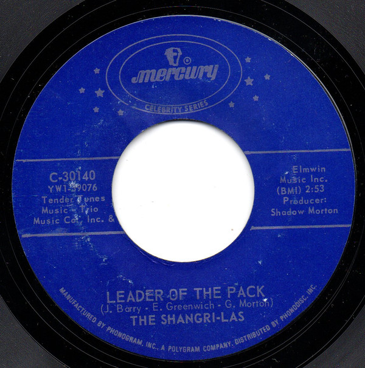

# Leader Of The Pack / I Can Never Go Home Anymore

By The Shangri-Las

## Album Data

[Discogs URL](https://www.discogs.com/release/2816081-The-Shangri-Las-Leader-Of-The-Pack-/-I-Can-Never-Go-Home-Anymore)

- Catalog #: C-30140
- Label: Mercury
- Formats: Vinyl
- Format: 7", Single, RP
- Rating: 
- Released: 0
- Year: 0
- Release ID: 2816081
- Media condition: Very Good Plus (VG+)
- Sleeve condition: 
- Speed: 45 rpm
- Weight: 

## Album Tracks

| **Position** | **Title** | **Duration** |
|--------------|-----------|--------------|
| A | **Leader Of The Pack** | 2:53 |
| B | **I Can Never Go Home Anymore** | 3:13 |

## Artist Roles

| **Name** | **Role** |
|----------|----------|
| **George "Shadow" Morton** | Producer |

## See also

- 
