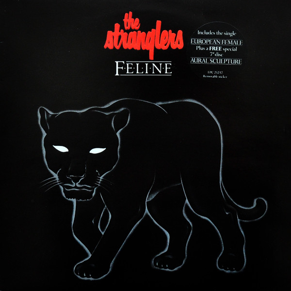

# Feline

By The Stranglers

## Album Data

[Discogs URL](https://www.discogs.com/release/517849-The-Stranglers-Feline)

- Catalog #: EPC 25237
- Label: Epic
- Formats: Vinyl
- Format: LP, Album, Ltd + 7", S/Sided, S/Edition, Limited Edition, 45 RPM, Single Sided, Special Edition
- Rating: 
- Released: 1982
- Year: 1982
- Release ID: 517849
- Media condition: Very Good Plus (VG+)
- Sleeve condition: Generic
- Speed: 45 rpm
- Weight: 

## Album Tracks

| **Position** | **Title** | **Duration** |
|--------------|-----------|--------------|
| A1 | **Midnight Summer Dream** |  |
| A2 | **It's A Small World** |  |
| A3 | **Ships That Pass In The Night** |  |
| A4 | **The European Female (In Celebration Of)** |  |
| B1 | **Let's Tango In Paris** |  |
| B2 | **Paradise** |  |
| B3 | **All Roads Lead To Rome** |  |
| B4 | **Blue Sister** |  |
| B5 | **Never Say Goodbye** |  |
|  | **Free Special 7" Disc** |  |
| C | **Aural Sculpture** |  |

## Artist Roles

| **Name** | **Role** |
|----------|----------|
| **Nick Marchant** | Art Direction |
| **Nick Marchant** | Design |
| **Tim Widdall** | Design |
| **Henry Arden** | Photography By [Insert] |
| **The Stranglers** | Written-By |

## See also

- 
- [Beets: Original John Peel Session](../../Beets/The_Stranglers/Original_John_Peel_Session.md)
