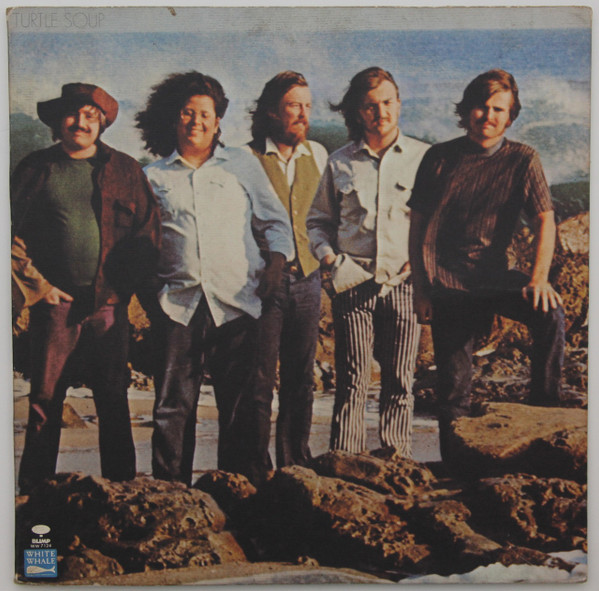

# Turtle Soup

By The Turtles

## Album Data

[Discogs URL](https://www.discogs.com/release/2035472-The-Turtles-Turtle-Soup)

- Catalog #: WW 7124, WWS-7124
- Label: White Whale, White Whale
- Format: LP, Album, Mon
- Rating: 
- Released: 1969
- Release ID: 2035472
- Media condition: Very Good (VG)
- Sleeve condition: Very Good (VG)
- Speed: 33 rpm
- Weight: 

## See also

- [Happy Together](Happy_Together.md)
- [Beets: Happy Together](../../Beets/The_Turtles/Happy_Together.md)
- [Beets: It Ain't Me Babe](../../Beets/The_Turtles/It_Aint_Me_Babe.md)
- [Beets: The Turtles Present the Battle of the Bands](../../Beets/The_Turtles/The_Turtles_Present_the_Battle_of_the_Bands.md)
- [Beets: Turtle Soup](../../Beets/The_Turtles/Turtle_Soup.md)
- [Roon: Happy Together (Deluxe Version) (Remastered)](../../Roon/The_Turtles/Happy_Together_Deluxe_Version_Remastered.md)
- [Roon: It Ain't Me Babe (Deluxe Version) (Remastered)](../../Roon/The_Turtles/It_Aint_Me_Babe_Deluxe_Version_Remastered.md)
- [Roon: The Battle of the Bands (Deluxe Version)](../../Roon/The_Turtles/The_Battle_of_the_Bands_Deluxe_Version.md)
- [Roon: Turtle Soup (Deluxe Version) (Remastered)](../../Roon/The_Turtles/Turtle_Soup_Deluxe_Version_Remastered.md)
- [Roon: You Baby (Deluxe Version) (Remastered)](../../Roon/The_Turtles/You_Baby_Deluxe_Version_Remastered.md)
